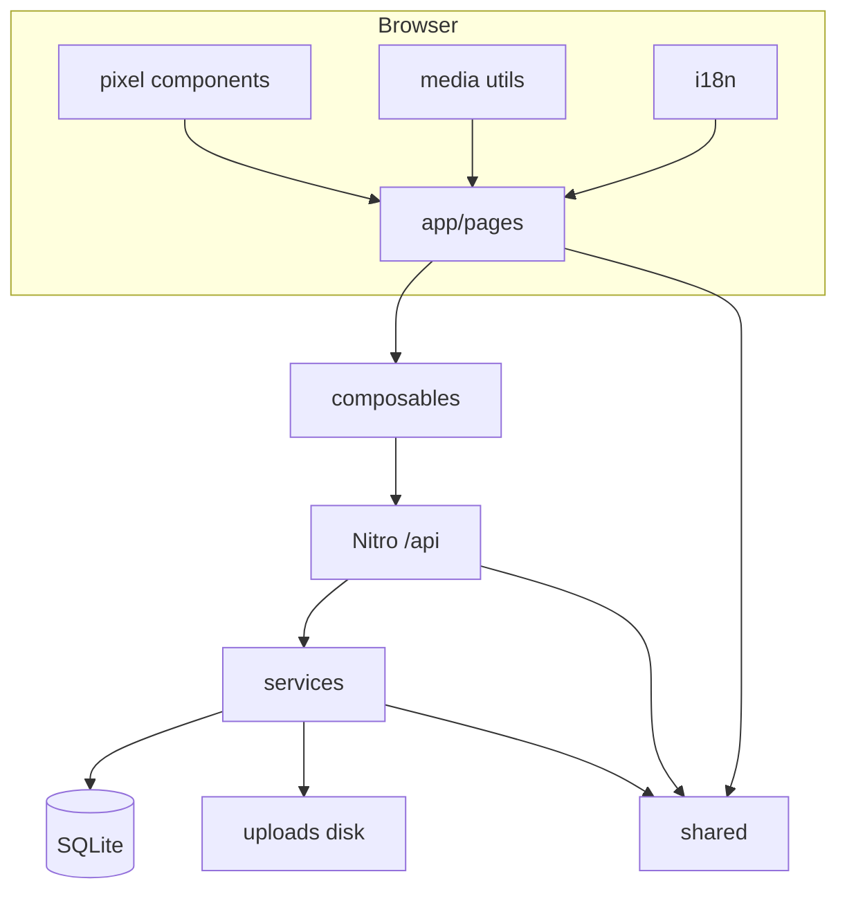

# Dependency graph

## Module edges

`pages → composables → api → services → database | disk`; `pages → pixel | admin | staff`; `shared` imported by app and server only. `coop` and `media-submission` services called from turn scan and dedicated API routes.

## Roles and routes

| Role | Key routes | Session |
|------|------------|---------|
| Team | `/:edition/play`, onboarding, join | team cookie |
| Crew | `/:edition/crew/*` | crew cookie + edition token |
| Admin | `/admin/*` | admin cookie |
| Public | leaderboard, legal, `/` | — |

## Pipelines

- **Tasks:** admin UI → `api/admin/…/tasks` → `utils/admin-task*` → `tasks` table.
- **Media:** `MediaTaskUpload` → `turns/…/submission` → disk → crew `submissions/…/content`.
- **Coop:** scan → `coop.ts` depot → partner scan → optional `coop/link` bonus.
