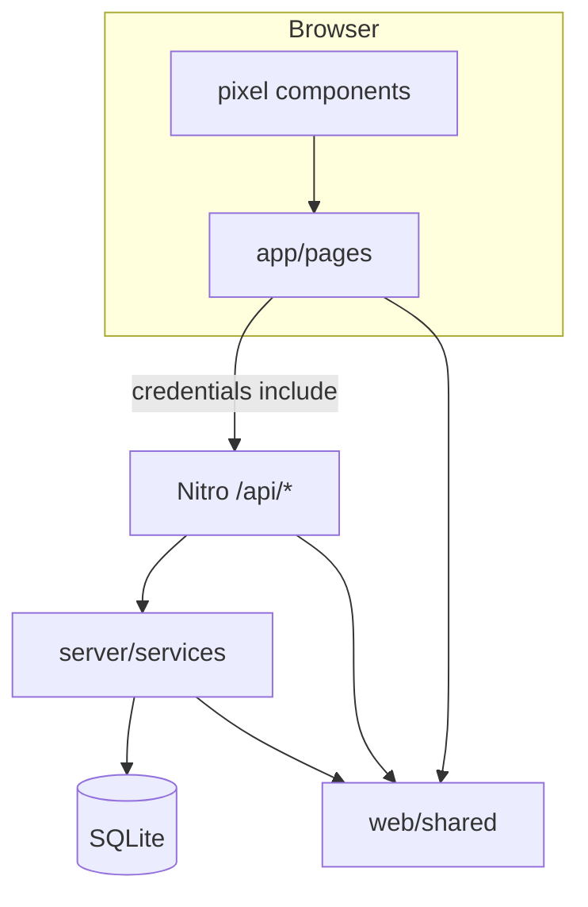

# Dependency graph



## Module edges

```
app/pages → app/composables → server/api → server/services → server/database
                ↓                              ↓
            web/shared  ←────────────────────────┘
server/api → server/utils (sessions, config)
server/plugins → server/database
```

- **shared** — no imports from server/app
- **services** — database, utils, shared
- **api** — services, utils, shared; never imported by services
- **app** — shared + HTTP to api only

## Roles and routes

| Role | Key routes | Session |
|------|------------|---------|
| Team | `/[edition]/join`, `/play`, `/s/:slug`, `/t/:slug` | `team_session` |
| Crew | `/[edition]/crew/*` | `crew_session` |
| Admin | `/admin/*` | `admin_session` |
| Public | `/leaderboard`, `/`, `/privacy` | — |
