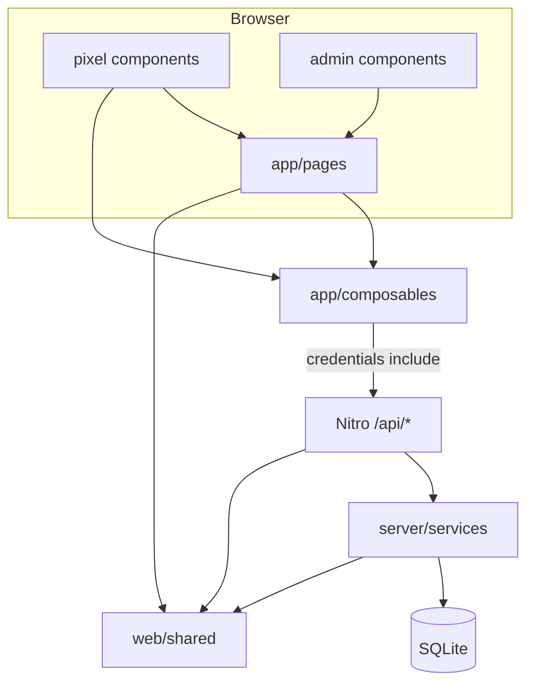

# Dependency graph

## Module edges

`pages → composables → api → services → database`; `pages → pixel | admin`; `layouts → pages`; all use `shared`. `api → utils`; `plugins → database`. Services never import api; shared imports nothing from app/server.

## Roles and routes

| Role | Key routes | Session |
|------|------------|---------|
| Team | `/[edition]/join`, `/play`, `/s/[slug]`, `/t/[slug]` | team cookie |
| Crew | `/[edition]/crew/*` | crew cookie |
| Admin | `/admin/*` | admin cookie |
| Public | `/leaderboard`, `/`, `/privacy` | — |
