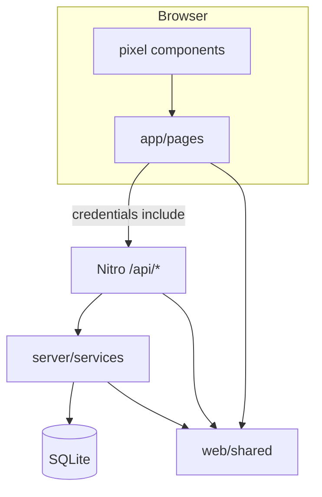

# ARCHITECTURE.md — 99trees

Nuxt 4 monolith: Team PWA (`/play`), Crew UI (`/crew`), public Leaderboard, minimal Admin. SQLite + Drizzle; game logic on Nitro.

## Roles & routes

| Role | Pages | Session cookie |
|------|-------|----------------|
| Team | `/join`, `/rejoin`, `/play`, `/s/:slug`, `/t/:slug` | `team_session` |
| Crew | `/crew`, `/crew/teams/:id` | `crew_session` |
| Admin | `/admin`, `/admin/init` | `admin_session` |
| Public | `/leaderboard`, `/`, `/rules`, `/privacy` | — |

## Turn state machine (server source of truth)

States in `turns.state`: `rolled` → `scanned` → (`awaiting_crew` if performance) → `completed` → confirm → idle.  
Branches: `abandon` from `rolled` (zero-round); performance plugin may set `completed` on timeout.

Open-turn detection: `getOpenTurn()` in `server/services/game.ts` (states except `abandoned`).

## Layer responsibilities

| Layer | Responsibility |
|-------|----------------|
| `server/api/**` | Auth gate, Zod parse, HTTP status — delegate to services |
| `server/services/game.ts` | Roll, hints, scan, answer, confirm, `buildMePayload` |
| `server/services/crew.ts` | Search, rate, reset-pin |
| `shared/scoring.ts` | Pure score math (base 100, time bonus from scan, hint penalties) |
| `shared/schemas.ts` | Request/response Zod contracts |
| `app/pages/play.vue` | Main game loop UI — mirrors `/api/me` |

## Key files

| File | Why it matters |
|------|----------------|
| `server/database/schema.ts` | `editions`, `stations`, `teams`, `turns`, `crew_ratings` |
| `server/utils/edition-config.ts` | Parses `editions.configJson` → `EditionConfig` |
| `server/utils/team-session.ts` | Team cookie + `completed_fields` JSON |
| `shared/types.ts` | `TurnState`, `EditionConfig`, task payloads |
| `app/composables/useGameApi.ts` | Authenticated `$fetch` wrapper |
| `app/composables/useScoreFeedback.ts` | Point delta toasts/flash |
| `app/components/pixel/BirdBoard.vue` | Board visualization |
| `app/components/StationQrScanner.vue` | In-app station QR |

## API surface (implemented)

**Public:** `GET /api/health`, `GET /api/leaderboard`, `GET /api/editions/:id/public`

**Team (cookie):** `POST /api/teams`, `POST /api/teams/rejoin`, `PATCH /api/teams/pin`, `GET /api/me`, `POST /api/turns/roll`, `POST /api/turns/:id/{hint,scan,answer,confirm,abandon}`

**Crew:** `POST /api/crew/login|logout`, `GET /api/crew/pending`, `GET /api/crew/teams/search`, `GET /api/crew/teams/resolve`, `GET /api/crew/teams/:id`, `POST /api/crew/rate`, `POST /api/crew/teams/:id/reset-pin`

**Admin:** `POST /api/admin/init|login`, `GET|POST /api/admin/editions`, `PATCH /api/admin/editions/:id`, `GET .../checklist`, `POST .../stations/import`

## Data model (concise)

- **Edition:** `fieldCount`, `status` (`draft|live|paused|ended`), `configJson` (dice, hint timers/costs, perf timeout), `crewPasswordHash`
- **Station:** one per field 1…N; `qrToken`, hints, `taskType` + `taskPayloadJson`
- **Team:** `positionConfirmed`, `scoreTotal`, `completedFieldsJson`, `pinHash`, `teamQrToken`
- **Turn:** dice, pending position, hint mode/levels, `scoreDelta` on confirm

## Cross-cutting

- **Auth:** Separate cookies per role; init admin via env secret once.
- **DB:** `better-sqlite3`; path from `runtimeConfig.sqliteDatabasePath`.
- **Plugins:** `00-database-migration`, `01-performance-timeout` (60s poll).
- **Alias:** `#shared` → `web/shared` (Nuxt + Vite).

## Invariants

- Dependency: `api` → `services` → `db`; `shared` has no DB/framework imports.
- Scoring changes must stay in `shared/scoring.ts` so client previews can match server later.
- Do not trust client for position, dice, or points — all mutations via API + services.

## Deeper maps

- UI codemap: [`docs/AGENTS_APP.md`](docs/AGENTS_APP.md)
- Server codemap: [`docs/AGENTS_SERVER.md`](docs/AGENTS_SERVER.md)
- Doc index: [`docs/AGENTS_ARCHITECTURE.md`](docs/AGENTS_ARCHITECTURE.md)
