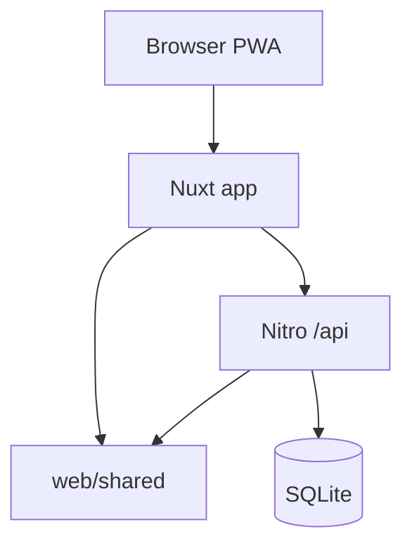

# ARCHITECTURE.md — 99trees

Single Nuxt 4 application: Team PWA, Crew UI, public Leaderboard, minimal Admin.

## Layers

- **app/** — pages, pixel components, composables
- **server/api/** — REST handlers
- **server/services/** — game logic, auth
- **shared/** — scoring, Zod schemas, types

## Auth (MVP)

- **Teams:** opaque session cookie after join/rejoin (PIN)
- **Crew:** crew session cookie after password login
- **Admin:** init secret + session (minimal)
