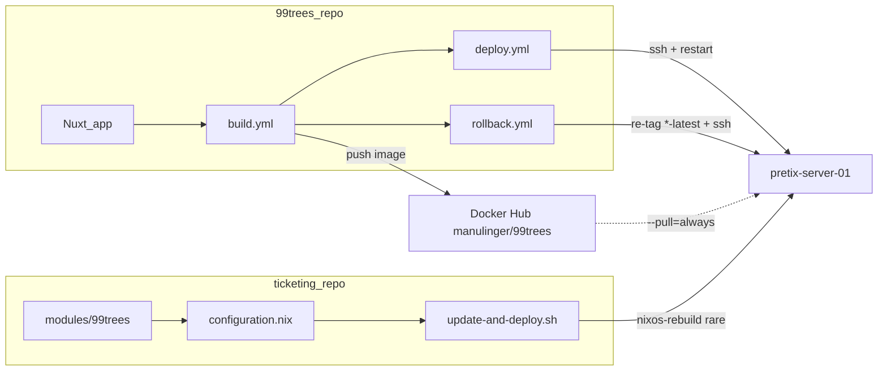

# Deployment

Operator runbook for shipping 99trees (Zugvögel) to `pretix-server-01`. Release
semantics: [`.cursor/skills/release/SKILL.md`](../.cursor/skills/release/SKILL.md).

## Architecture

The **ticketing** repo owns NixOS: [`modules/99trees/default.nix`](../../ticketing/modules/99trees/default.nix)
(`zugvoegel.services.trees99`), instance pins, SOPS secrets, host rebuilds.

The **99trees** repo owns the app, [`Dockerfile`](../Dockerfile), and GitHub
Actions (build, deploy, rollback). Image releases never run `nixos-rebuild` on
the host.



Floating tags `prod-latest` / `test-latest` point at the current release;
immutable tags (`0.0.2`, `test-0.0.1-3`, …) are kept for rollbacks.

## One-time setup

### 1. GitHub Actions secrets (99trees repo)

| Secret | Description |
|--------|-------------|
| `DOCKER_USERNAME` | Docker Hub user (`manulinger`). |
| `DOCKER_PASSWORD` | Docker Hub token with push to `manulinger/99trees`. |
| `SSH_PRIVATE_KEY` | Deploy key: `ssh-keygen -t ed25519 -C "github-actions-99trees"`. |
| `SSH_HOST` | (Optional) Host/IP. Default `185.232.69.172`. |
| `SSH_KNOWN_HOSTS` | (Optional) `ssh-keyscan -t ed25519 …` for MITM hardening. |

Create the Docker Hub repository `manulinger/99trees` if it does not exist.

### 2. Public key on the host (ticketing)

Add the pubkey matching `SSH_PRIVATE_KEY` to
`zugvoegel.services.trees99.deployAuthorizedKeys` in
[`ticketing/configuration.nix`](../../ticketing/configuration.nix) (replace the
`TODO` placeholder), then:

```bash
cd ../ticketing
./update-and-deploy.sh
```

The shared unprivileged `deploy` user is created by the schwarmplaner module;
99trees merges additional keys and sudo rules for `manulinger/99trees` only.

### 3. SOPS env-files

`99trees-prod-envfile` and `99trees-test-envfile` in
[`ticketing/secrets/secrets.yaml`](../../ticketing/secrets/secrets.yaml). See
[`ticketing/secrets/README.md`](../../ticketing/secrets/README.md).

Required variables:

- `NUXT_SESSION_PASSWORD` (≥32 chars)
- `NUXT_ADMIN_INIT_SECRET`
- `NUXT_CREW_SESSION_PASSWORD` (≥32 chars)
- `NUXT_ENVIRONMENT` (`production` or `test`)

SQLite path defaults to `/data/db.sqlite` in the image; the host mounts
`/var/lib/99trees-<env>/data` → `/data`.

### 4. DNS

- `spiel.zugvoegelfestival.org` → A record
- `test.spiel.zugvoegelfestival.org` → A record (required before first test deploy)

### 5. First host activation

After the ticketing module and `configuration.nix` are committed:

```bash
cd ../ticketing
./update-and-deploy.sh
```

Until the first successful `build.yml` push, container units may fail to start
(no image on Hub yet).

## Day-to-day

### Test release

```bash
bash .cursor/skills/release/scripts/release-test.sh
```

Tag `test-X.Y.Z-N` → `build.yml` pushes `:test`, `:<tag>`, `:test-latest` →
`deploy.yml` backs up data, `docker pull`, restarts
`docker-99trees-test.service`, checks `/api/health`.

### Production release

```bash
bash .cursor/skills/release/scripts/release-prod.sh patch   # or minor / major
```

Tag `vX.Y.Z` → images `:latest`, `:X.Y.Z`, `:prod-latest` → production deploy
(GitHub `environment: production` if configured).

### Host / module changes

Edit [`ticketing/modules/99trees/default.nix`](../../ticketing/modules/99trees/default.nix)
and/or `zugvoegel.services.trees99` in
[`ticketing/configuration.nix`](../../ticketing/configuration.nix), then:

```bash
cd ../ticketing
./update-and-deploy.sh
```

## Rollbacks

### Image rollback

**GitHub:** Actions → *Rollback Docker image* → environment + immutable tag
(e.g. `0.0.2` or `test-0.0.1-3`).

### Data rollback (SQLite)

Pre-deploy tarballs: `/var/backups/99trees-{test,prod}/`.

```bash
ssh root@pretix-server-01 'systemctl stop docker-99trees-prod.service \
  && tar -xzf /var/backups/99trees-prod/<file>.tar.gz -C /var/lib/99trees-prod/ \
  && systemctl start docker-99trees-prod.service'
```

Pair with an image rollback if the DB snapshot matches an older schema.

## Local smoke test

```bash
docker build -t 99trees:local .
docker run --rm -p 3000:3000 -v "$(pwd)/.data:/data" \
  -e NUXT_SESSION_PASSWORD="local-dev-session-password-32-chars-min" \
  -e NUXT_ADMIN_INIT_SECRET="local-init-secret" \
  -e NUXT_CREW_SESSION_PASSWORD="local-crew-session-password-32-ch" \
  99trees:local
curl -sf http://localhost:3000/api/health | jq .
```

## Troubleshooting

- `systemctl status docker-99trees-{test,prod}.service`
- `journalctl -u docker-99trees-prod.service -f`
- `curl -sf https://spiel.zugvoegelfestival.org/api/health | jq .`
- Backups: `ls /var/backups/99trees-prod/`

See also [`docs/DEPLOY.md`](./DEPLOY.md) for env reference and backup notes.
