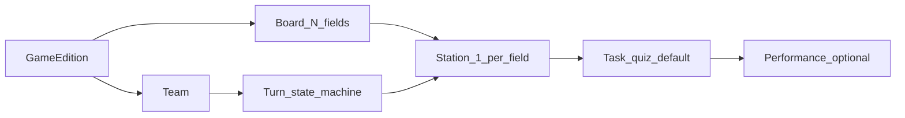

# Zugvögel — Scope & Funktionalitäten (MVP)

Agent hub for the German product spec. **Detail lives in linked leaves** — load one part per task.

| Part | Load when |
| ---- | --------- |
| [scope/DESIGN.md](./scope/DESIGN.md) | Pixel UI, tokens, copy examples |
| [scope/RULES.md](./scope/RULES.md) | Game rules, scoring, turn state machine |
| [scope/FLOWS-ADMIN-ONBOARDING.md](./scope/FLOWS-ADMIN-ONBOARDING.md) | Admin setup, join, rejoin, onboarding |
| [scope/FLOWS-PLAY.md](./scope/FLOWS-PLAY.md) | Turn loop (roll → scan → task → confirm) |
| [scope/FLOWS-CREW-LEADERBOARD.md](./scope/FLOWS-CREW-LEADERBOARD.md) | Crew rating, PIN reset, leaderboard |
| [scope/CATALOG.md](./scope/CATALOG.md) | MVP feature list, data model, API sketch, NFR |

Implementation truth: [`AGENTS_ARCHITECTURE.md`](./AGENTS_ARCHITECTURE.md). Deviations → check code.

# Zugvögel — Scope & Funktionalitäten (MVP)

## Kontext

- **Produkt:** Progressive Web App für das Geländespiel „Zugvögel“ (Zugvögel Festival, Udenbreth)
- **Repo:** Nuxt-Monolith unter `web/` (`app`, `server`, `shared`); Agent-Kontext: `AGENTS.md`, `web/README.md`, `docs/AGENTS_ARCHITECTURE.md`
- **Implementierungsstand:** MVP-Kern (Team-Loop, Crew, Leaderboard, Admin minimal) — Details in [`docs/AGENTS_ARCHITECTURE.md`](AGENTS_ARCHITECTURE.md); Abweichungen von diesem Plan in Code prüfen
- **Deployment-Kontext:** Docker auf NixOS über ticketing-Infrastruktur — [`DEPLOY.md`](DEPLOY.md)
- **Entscheidungen (von dir):** MVP fürs erste Festival · **„99“ = Spielname**, nicht Feldanzahl · **Felder = Anzahl Aufgaben/Stationen** (z.B. 30–50, editionabhängig) · Brett zentral (Würfeln + Fortschritt) · **Highscore** entscheidet unter Teams, die das **Ziel-Feld** erreicht haben · **Spieler-UI DE/EN** — siehe § Sprache & Copy

---

## Sprache & Copy (festgelegt)

| Bereich | Sprache |
|---------|---------|
| **Spieler-UI** (Join, Rejoin, Play, Regeln, Datenschutz) | **Deutsch (Standard)** + **Englisch** (Umschalter, `@nuxtjs/i18n`) |
| **Crew- & Admin-UI** | **English** |
| **Fehlermeldungen (API)** | English (Server); Spieler-UI mappt bekannte Meldungen clientseitig |
| **Task-Content** (Quiz-Fragen, Hinweise, Performance-Texte) | Edition-Daten (JSON/YAML-Import): **DE + EN** pro Feld; Spieler-UI wählt per Locale |
| **Technik** | `<html lang>` folgt aktiver Locale; Cookie-Persistenz für Spieler-Sprache |

**Beispiel-Copy (Referenz für Implementierung):**

| Kontext | Text (EN) |
|---------|-----------|
| CTA Würfeln | `ROLL DICE` |
| Station scannen | `SCAN STATION` |
| Alle Hinweise | `REVEAL ALL HINTS` (−50 points) |
| Neu würfeln | `ROLL AGAIN` (0-round — no progress) |
| Warte Crew | `Waiting for crew…` |
| Punkte minus | `−50 points` (toast) |
| Ziel erreicht | `You reached the end of the migration!` |
| Team wiederfinden | `Find your team` |
| Falsche Station | `Wrong station — you're looking for field {n}` |

Plan-Dokumentation (dieses Dokument) bleibt auf Deutsch; **Spieler-Copy ist DE/EN**, Crew/Admin weiter Englisch.

---

## Akteure & Oberflächen

| Rolle | Gerät | Oberfläche | MVP |
|-------|--------|------------|-----|
| **Team** | 1 Smartphone pro Team (1–5 Personen) | Spieler-App | Ja |
| **Crew** | Smartphone/Tablet | Crew-Bewertung (Performance) | Ja |
| **Organisation** | Laptop | Content-Konfiguration (kein Voll-CMS) | Minimal |
| **Publikum** | beliebig | Leaderboard (read-only) | Ja |

**Nicht im MVP:** separates Mitspieler-Login, App-Store-Install, Spieler-Accounts mit E-Mail/Passwort zuhause. **Im MVP:** Team-PIN (4 Ziffern) + Rejoin + Crew/Admin PIN-Reset.

## Kern-Domain-Begriffe

- **Edition / Spielinstanz:** ein Festival-Durchlauf; **`field_count` = Anzahl Stationen** (Import)
- **„99“ / Zugvögel:** Markenname — **nicht** die Feldzahl
- **Feld (1…N):** Position auf dem Vogelzug-Brett; **genau eine Station/Aufgabe** pro Feld
- **Station:** physischer Ort + Stations-QR
- **Aufgabe:** **Quiz** (Default, automatisch) · **Performance** (Optional, nur wo Crew mitmacht + Erkennungsmerkmal)
- **Zug:** Würfeln → suchen → QR → Aufgabe → bestätigen · oder **0-Runde** (Neu würfeln)

