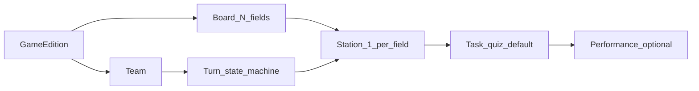
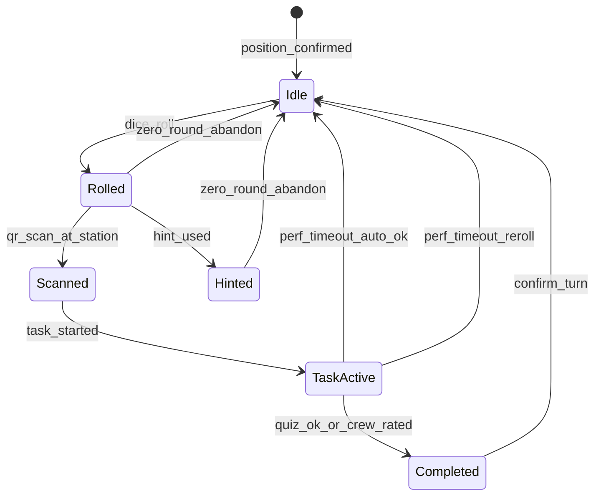
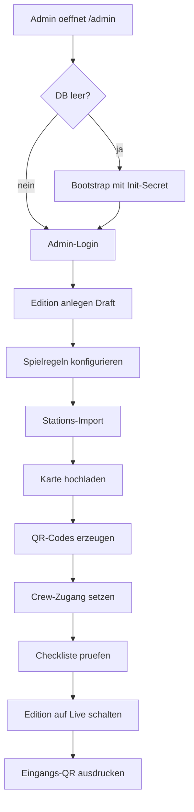
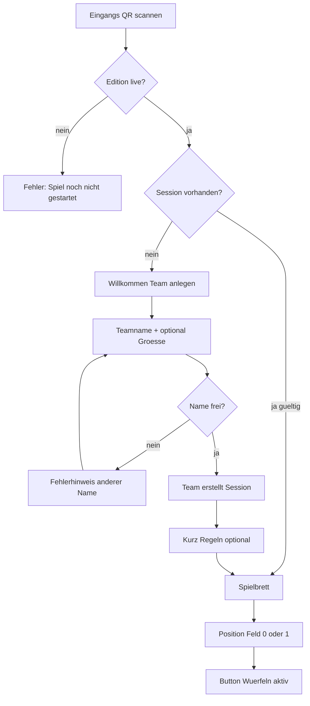
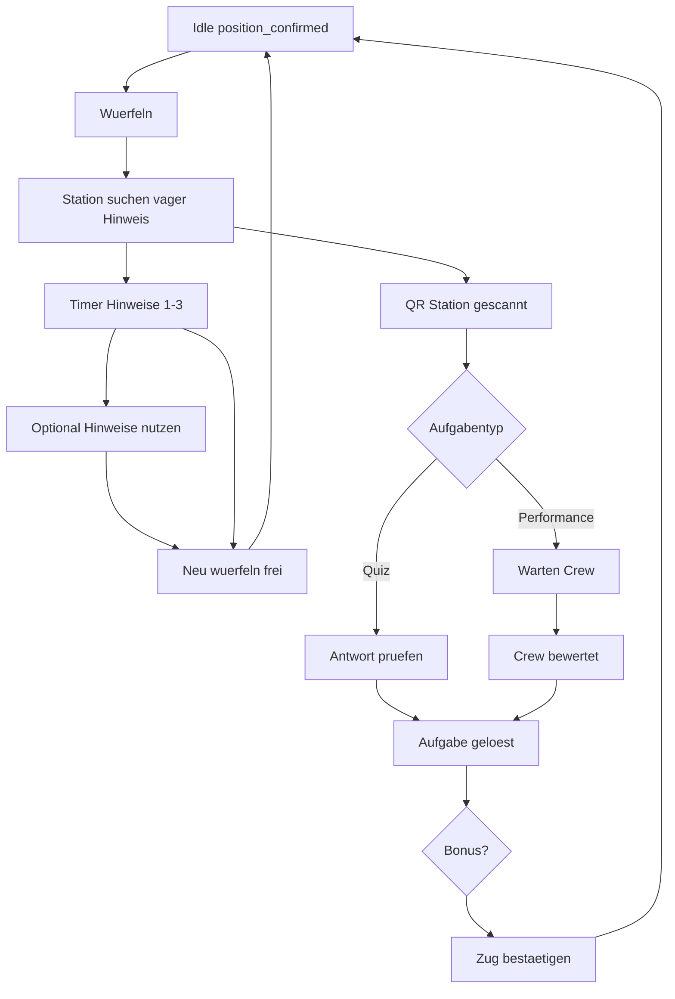
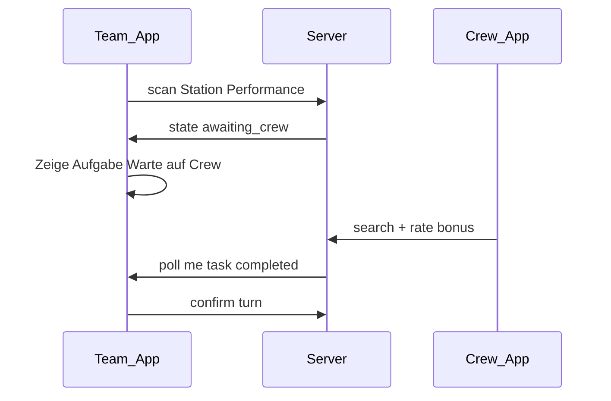

# Zugvögel — Scope & Funktionalitäten (MVP)

## Kontext

- **Produkt:** Progressive Web App für das Geländespiel „Zugvögel“ (Zugvögel Festival, Udenbreth)
- **Repo:** Nuxt-Monolith unter `web/` (`app`, `server`, `shared`); Agent-Kontext: `AGENTS.md`, `web/README.md`, `.vibe/docs/`
- **Implementierungsstand:** MVP-Kern (Team-Loop, Crew, Leaderboard, Admin minimal) — Details siehe Codemaps; Abweichungen von diesem Plan in Code prüfen
- **Deployment-Kontext:** Docker auf NixOS über [ticketing](file:///Users/manuel.huettel/Repos/privat/ticketing)-Infrastruktur (analog Schwarmplaner-Subdomain)
- **Entscheidungen (von dir):** MVP fürs erste Festival · **„99“ = Spielname**, nicht Feldanzahl · **Felder = Anzahl Aufgaben/Stationen** (z.B. 30–50, editionabhängig) · Brett zentral (Würfeln + Fortschritt) · **Highscore** entscheidet unter Teams, die das **Ziel-Feld** erreicht haben · **UI-Sprache: Englisch** (alle sichtbaren Texte)

---

## Sprache & Copy (festgelegt)

| Bereich | Sprache |
|---------|---------|
| **App-UI** (Team, Crew, Leaderboard, Admin) | **English** |
| **Fehlermeldungen, Buttons, Dialoge, Toasts** | **English** |
| **Stations-Content** (Quiz-Fragen, Hinweise, Performance-Texte) | **English** (YAML-Import) |
| **Rechtliches** (`/privacy`, `/imprint` falls MVP) | **English** |
| **Technik** | `lang="en"` auf `<html>`; MVP **kein** i18n-Framework — nur `en`, keine Sprachumschaltung |

**Beispiel-Copy (Referenz für Implementierung):**

| Kontext | Text (EN) |
|---------|-----------|
| CTA Würfeln | `ROLL DICE` |
| Station scannen | `SCAN STATION` |
| Alle Hinweise | `REVEAL ALL HINTS` (−50 points) |
| Neu würfeln | `ROLL AGAIN` (0-round — no progress) |
| Warte Crew | `Waiting for crew…` |
| Punkte minus | `−50 points` (toast) |
| Ziel erreicht | `You reached the end of the migration!` |
| Team wiederfinden | `Find your team` |
| Falsche Station | `Wrong station — you're looking for field {n}` |

Plan-Dokumentation (dieses Dokument) bleibt auf Deutsch; **Produkt-Copy ist Englisch**.

---

## Akteure & Oberflächen

| Rolle | Gerät | Oberfläche | MVP |
|-------|--------|------------|-----|
| **Team** | 1 Smartphone pro Team (1–5 Personen) | Spieler-App | Ja |
| **Crew** | Smartphone/Tablet | Crew-Bewertung (Performance) | Ja |
| **Organisation** | Laptop | Content-Konfiguration (kein Voll-CMS) | Minimal |
| **Publikum** | beliebig | Leaderboard (read-only) | Ja |

**Nicht im MVP:** separates Mitspieler-Login, App-Store-Install, Spieler-Accounts mit E-Mail/Passwort zuhause. **Im MVP:** Team-PIN (4 Ziffern) + Rejoin + Crew/Admin PIN-Reset.

---

## Look & Feel — 8-Bit Retro-Hybrid

**Richtung (festgelegt):** Wie ein **8-Bit-Pixelspiel** in Farbe und Form — aber **Retro-Hybrid** für Festival-Betrieb: große Touch-Flächen, lesbar in Sonne, keine Mini-Pixel-Schriften im Fließtext.

**Stimmung:** **Morgendämmerung / Vogelzug** — Süd (warm) → Nord (kühl), Wald & Himmel.

### Design-Prinzipien

| Prinzip | Umsetzung |
|---------|-----------|
| Pixel-Identität | Pixel-Font für **Überschriften, Buttons, Punkte, Feldnummern**; System-Font nur für längere Texte (Regeln, Aufgaben) |
| Formen | **Eckig** — `border-radius: 0` oder max. `4px`; „Stepped“-Schatten (2–4px offset), keine weichen Material-Schatten |
| Buttons | Chunky, 3–4px **Pixel-Rahmen**, Pressed-State (1px nach unten/rechts), Primary = warm, Secondary = Waldgrün |
| Icons | 16×16 oder 24×24 **Pixel-Art** (Sprite-Sheet oder SVG mit `shape-rendering: crispEdges`) |
| Spielbrett | **Pixel-Art Vogelzug** — scrollbare Karte, Team-Marker als kleine Vogel-Sprites |
| Feedback | Punkte +/- als **Pixel-Popup** (rot/grün), kurze 8-Bit-Animation (CSS, 2–4 Frames) |
| Nuxt UI | Basis-Layout; **eigene** `PixelButton`, `PixelCard`, `PixelDialog` — Nuxt UI nur wo es passt (z.B. Form-Inputs mit Override) |

### Farbpalette „Dawn Forest“ (Entwurf Tokens)

| Token | Hex (Entwurf) | Verwendung |
|-------|---------------|------------|
| `sky-dawn` | `#6B5B95` → Gradient zu `#E8A87C` | Hintergrund Himmel (Süd oben / Nord unten optional) |
| `forest-dark` | `#2D4A3E` | Primär-Text, Rahmen |
| `forest-mid` | `#4A7C59` | Buttons Secondary, Brett-Wiese |
| `forest-light` | `#8FBC8F` | Flächen, erfolgreiche States |
| `sunrise` | `#FFB347` | Primary CTA (`ROLL DICE`, `SCAN STATION`) |
| `sunset` | `#E8784A` | Akzent, Warnungen |
| `pixel-white` | `#F4F1DE` | Karten-Hintergrund (nicht reines #FFF — weniger Blendung outdoor) |
| `pixel-black` | `#1A1C2C` | Rahmen, Schatten |
| `score-plus` | `#6BCB77` | Punkte gewonnen |
| `score-minus` | `#E85D5D` | Punkte verloren |
| `gold` | `#FFD700` | Ziel erreicht, Highscore-Spitze |

**Kontrast:** WCAG AA für Fließtext; Buttons min. 44×44px Touch — **Lesbarkeit > purer Retro**.

### Typografie

| Rolle | Font (Vorschlag) | Größe mobil |
|-------|------------------|-------------|
| Display / Logo | `Press Start 2P` oder `Silkscreen` | 14–18px |
| UI / Buttons | `Press Start 2P` | 12–14px |
| Body / Aufgaben | `Inter` oder System sans | 16–18px |
| Zahlen (Würfel, Punkte) | Pixel-Font | groß, zentriert |

### Komponenten-Bildsprache

```text
┌─────────────────────────────┐  ← 4px pixel border (#1A1C2C)
│  ▶ SCAN STATION             │  ← Press Start 2P, sunrise fill
└─────────────────────────────┘
     ▓▓ shadow offset 4px
```

- **Würfel-Animation:** 6 Frames Pixel-Würfel oder CSS-Rotate mit Pixel-Sprite
- **Team-Marker auf Brett:** kleiner Vogel (2–3 Farben), eigene Farbe pro Team optional V1
- **Hinweis-Stufen:** drei „Tipp-Icons“ (Feder / Fußspur / Karte) als Pixel-Sprites
- **QR-Screen:** Scan-Rahmen als Pixel-Ecken (nicht moderner Rounded Scanner)

### Screens nach Rolle

| Bereich | Look |
|---------|------|
| `/play`, `/join` | Volle Spiel-Ästhetik — Brett dominiert |
| `/leaderboard` | Pixel-Brett mini + Rangliste als „High-Score-Tabelle“ (Arcade) |
| `/crew` | Gleiche Tokens, etwas **ruhiger** (weniger Deko, schnelle Buttons) |
| `/admin` | Gleiche Farben, **mehr** Lesefont — Funktion vor Deko |

### UX + 8-Bit (Punkte-Feedback)

- Minus: roter Pixel-Text `−50` floatet nach oben + kurzer „damage“ sound optional V1
- Plus: grüner `+115` beim Zug-Abschluss
- Buttons mit Minus-Aktion: Label immer `−XX Punkte` in `score-minus` Farbe

### Technik (Nuxt)

- `web/app/assets/css/pixel-theme.css` — CSS-Variablen
- `app.config.ts` / Nuxt UI `ui` overrides wo möglich
- Komponenten: `web/app/components/pixel/*`
- Spielbrett: `BirdBoard.vue` + statisches PNG/WebP **oder** Canvas/SVG Pixel-Grid
- `image-rendering: pixelated` für Sprites

### Bewusst nicht MVP

- Vollständiger CRT-Scanline-Overlay (optional V1, Toggle)
- 8-Bit-Musik/SFX (V1 — braucht User-Geste wegen Autoplay)
- Individuelle Team-Avatare
- Animierter Parallax-Hintergrund

### Offen für Feinschliff

- Finales Logo „Zugvögel“ / „99“ als Pixel-Wordmark
- Referenz-Screenshot-Moodboard (1 Seite)
- Dark mode (vermutlich nein — Outdoor-Festival)

---

## Kern-Domain-Begriffe



- **Edition / Spielinstanz:** ein Festival-Durchlauf; **`field_count` = Anzahl Stationen** (Import)
- **„99“ / Zugvögel:** Markenname — **nicht** die Feldzahl
- **Feld (1…N):** Position auf dem Vogelzug-Brett; **genau eine Station/Aufgabe** pro Feld
- **Station:** physischer Ort + Stations-QR
- **Aufgabe:** **Quiz** (Default, automatisch) · **Performance** (Optional, nur wo Crew mitmacht + Erkennungsmerkmal)
- **Zug:** Würfeln → suchen → QR → Aufgabe → bestätigen · oder **0-Runde** (Neu würfeln)

---

## Spielregeln → technische Regeln (verbindlich für MVP)

### Würfeln & Bewegung (Brett = zentral)

| Regel | Technische Umsetzung |
|-------|----------------------|
| Team würfelt in der App | Serverseitiger Zufall (1–6 oder konfigurierbar), **ein Wurf pro offenem Zug** |
| Vorwärts X Felder | Würfel-Schritte verbrauchen nur **noch nicht bestätigte** Felder; bereits bestätigte Felder werden **übersprungen** (O4: kein zweites Mal dieselbe Station) |
| Berechnung | Von `position_confirmed` aus `dice` Schritte vorwärts, Felder in `completed_fields` überspringen → `position_pending` (max `field_count`) |
| Vage Stationsbeschreibung | Nach Wurf: `hint_vague` für Station auf Feld `position_pending` |
| Zug bestätigt nur nach gelöster Aufgabe | `position_confirmed = position_pending` nach Task + Confirm; **Punkte** für diesen Zug in `score_delta` |
| Ziel | Letztes Feld = `field_count` (nicht literarisch 99) |

### Hinweise — Punkte-Ökonomie (festgelegt)

**Keine Feld-Strafen** durch Hinweise — nur **Punkteabzug** am Zug.

| Modus | Verhalten | Punkte (Entwurf) |
|-------|-----------|------------------|
| **Warten** | Stufe 1/2/3 werden nacheinander per Timer freigeschaltet; Nutzung **günstiger** | z.B. −10 / −12 / −15 (nur genutzte Stufen summieren) |
| **Alle sofort aufdecken** | Button „Alle Hinweise jetzt“ — sofort alle 3 sichtbar (Text + Karte) | z.B. **−50** Pauschal (teurer als geduldig alle einzeln) |
| Hinweise optional | Team muss keine nutzen | 0 Hinweis-Kosten |

Timer (Edition-Config): z.B. Stufe 1 nach 3 min, Stufe 2 nach 6 min, Stufe 3 nach 9 min — **Warten lohnt sich** punktemäßig.

### Neu würfeln = **0-Runde** (festgelegt)

| Regel | Technische Umsetzung |
|-------|----------------------|
| Auslöser | Station nicht gefunden; nach **„alle Hinweise jetzt“** sofort möglich (O5) **oder** alle 3 Timer-Stufen frei |
| UI O5 | Vor `reveal_all`: Bestätigung „−50 Punkte“; danach sofort **Neu würfeln** (0-Runde) anbieten |
| Effekt | **0-Runde:** kein Fortschritt, **`score_delta = 0`**, `position_confirmed` unverändert |
| Danach | Neuer Wurf von bestätigter Position erlaubt |
| Kein „Skip“ nach vorne | Man kann nicht ohne Aufgabe vorrücken |

### Aufgaben & Bewertung

| Typ | MVP | Anmerkung |
|-----|-----|-----------|
| **Quiz** | **Default** | Automatische Auswertung; jede Station mindestens Quiz |
| **Performance** | **Optional** | Nur an Stationen mit Crew vor Ort; Crew trägt **Erkennungsmerkmal** (Badge/Bändchen); Team-QR + Crew-Scan |
| **Weitere Typen** | V2+ | Bewusst später (Team-vs-Team etc.) |
| **Crew-Bonus „besonders gut“** | +25 Punkte, **kein Limit** (O8) | Performance optional; Engpass bewusst |
| **Performance-Timeout (O7)** | Nach z.B. 10 min `awaiting_crew`: **Auto-OK** (Basispunkte) **oder** Team wählt **Neu würfeln** (0-Runde) |

### Spielende & Wettbewerb — Punktesystem (festgelegt)

| Anzeige | Inhalt |
|---------|--------|
| **Vogelzug / Brett** | Zentral in Team-App: Position 0…**N** auf dem Vogelzug (Würfeln + vorwärts) |
| **Globale Liste** | Wo jedes Team steht (`position_confirmed`) — immer sichtbar |
| **Highscore (live)** | **Alle Teams** mit `score_total`; visuell getrennt: **unterwegs** vs. **Ziel erreicht** (z.B. Badge/Grau vs. Gold) |
| **Highscore (Edition ended)** | Nur noch Teams mit **Ziel erreicht**; Sortierung nach Punkten — offizieller Sieger |

**Sieger (Edition `ended`):**
- **Primär:** Teams mit Ziel erreicht → höchster `score_total`; bei Gleichstand **kürzeste Spielzeit** Start→Ziel (`reached_goal_at − created_at`) (O9)
- **Fallback (O10):** Kein Team erreicht N → Sieger = höchstes `position_confirmed`, bei Gleichstand höhere Punkte

Während `live`: Highscore zeigt alle Teams (unterwegs vs. fertig).

#### Punkte pro abgeschlossenem Zug (Entwurf)

| Faktor | Punkte |
|--------|--------|
| Station geschafft | +100 Basis |
| Hinweise (warten, einzeln) | −10 / −12 / −15 je genutzter Stufe |
| Alle Hinweise sofort | −50 Pauschal |
| Quiz-Fehlversuche | −5 pro Fehlversuch |
| Zeit (Scan → Confirm) | Bonus bis +50 (schneller = mehr) |
| Crew-Bonus | +25 |
| **0-Runde (Neu würfeln)** | **0** (kein Eintrag oder explizit 0) |
| Gelaufene Felder / Würfel | neutral |

`teams.score_total` = Summe erfolgreicher Züge; `turns.score_delta` + `hint_mode` (`wait` \| `reveal_all`) speichern.

#### Punkteformel v1 (zur Abnahme) + Rechenbeispiele

**Zeit (festgelegt — getrennt):**
- **Hinweis-Timer:** ab `rolled_at` — steuert Freischaltung Hinweis 1/2/3 (3/6/9 min)
- **Zeitbonus-Timer:** ab `scanned_at` (Stations-QR) bis `confirmed_at`  
  `zeit_bonus = max(0, 50 − floor(sekunden / 60) × 5)` — Suche zählt nicht gegen Zeitbonus

**Hinweis-Regeln:**
- Modus `reveal_all`: immer **−50** (auch wenn danach Station gefunden)
- Modus `wait`: nur **genutzte** Stufen summieren (−10 / −12 / −15)
- `reveal_all` und einzelne Stufen **schließen sich aus** pro Zug

| # | Szenario | Rechenung | **Punkte Zug** |
|---|----------|-----------|----------------|
| S1 | Perfekt: kein Hinweis, 2 min, 0 Fehlversuche | 100 + 45 − 0 | **145** |
| S2 | Geduldig: wartet alle Timer, nutzt Hinweis 1+2+3, 8 min, 1× falsch | 100 + 15 − 10 − 12 − 15 − 5 | **73** |
| S3 | Ungeduldig: „alle Hinweise jetzt“, 6 min, 2× falsch | 100 + 25 − 50 − 10 | **65** |
| S4 | Erst **0-Runde**, nächster Zug wie S1 | 0 + 145 | **145** (nur 2. Zug zählt) |
| S5 | Performance + Crew-Bonus, 4 min, kein Hinweis | 100 + 40 + 25 | **165** |
| S6 | **Vergleich Highscore:** Team Rot 8 Züge à ~120 = 960; Team Blau 6 Züge à ~145 = 870 | — | Rot gewinnt trotz langsamerem Vogelzug |

**Festival-Sieger (Beispiel N=42):** Team A und B erreichen Feld 42; A `score_total` 1840, B 1720 → **A gewinnt Highscore**. Team C Feld 38 → in Vogelzug-Liste, **nicht** im Highscore.

#### Offene Punkte & Widersprüche (Stand Plan)

| ID | Thema | Status | Klärungsfrage |
|----|--------|--------|----------------|
| O1 | **Highscore-Anzeige** | **entschieden** | Live: alle Teams (Punkte + unterwegs/fertig); nach Edition-Ende: nur Fertige im offiziellen Ranking |
| O2 | **Zeitbonus vs. Hinweise** | **entschieden** | Getrennte Timer: Hinweise ab Wurf, Zeitbonus ab Scan |
| O3 | **Würfel > Ziel** | implizit | Cap bei N; Aufgabe auf Feld N muss gelöst werden |
| O4 | **Gleiches Feld** | **entschieden: nein** | Bestätigte Felder bei Wurf überspringen; keine Station zweimal |
| O5 | **Nach reveal_all** | **entschieden** | Sofort 0-Runde möglich; **vorher** Hinweis „−50 Punkte“ |
| O6 | **Hinweis + Erfolg** | geklärt | Hinweise kosten Punkte auch bei Erfolg |
| O7 | **Performance-Timeout** | **entschieden** | Auto-OK **oder** Neu würfeln (0-Runde) |
| O8 | **Crew-Bonus-Limit** | **entschieden: nein** | — |
| O9 | **Gleichstand Punkte** | **entschieden** | Kürzeste Zeit Start → Ziel |
| O10 | **Kein Team am Ziel** | **entschieden: ja** | Fallback: höchstes Feld, dann Punkte |
| O11 | **Plan-Widersprüche** | **angepasst** | UF-3, F8, Abbruch-Text, State-Diagramm |
| O12 | — | erledigt | — |

#### UX — Punkte visuell (Pflicht MVP)

Jede Aktion mit Punktewirkung muss **sofort** sichtbar sein:

| Moment | UI |
|--------|-----|
| **Vor** kostenpflichtiger Aktion | Button/Dialog zeigt Preis: „−50 Punkte“, „−10 Punkte“ |
| **Nach** Abzug | Kurzanimation am Punktestand: rot, `−50`, Gesamtstand aktualisiert |
| **Nach** Zug-Bestätigung | Zusammenfassung: `+100 Basis`, `+30 Zeit`, `−15 Hinweis` → **+115 dieser Zug** |
| **Highscore / Header** | `score_total` blinkt rot (minus) oder grün (plus); optional Verlauf letzter Züge |
| **0-Runde** | „0 Punkte für diesen Versuch“ — kein roter Abzug am Gesamtstand (nur Hinweis-Kosten vorher schon abgezogen) |

Technik: `useScoreFeedback` Composable; `ScoreDeltaToast.vue`; Punkte-Breakdown in Confirm-Sheet.

### Spielmechanik — Unklarheiten, Spaß-Risiken, Klärungsbedarf

#### Noch nicht final geklärt (Priorität hoch)

| # | Thema | Problem | Empfehlung zur Klärung |
|---|--------|---------|------------------------|
| K1 | **Hinweis-Strafe bei Erfolg** | → **gelöst Richtung Punkte:** Hinweise reduzieren `score_delta`, nicht zwingend Felder | Formel in Punkte-Entwurf finalisieren |
| K2 | **Warten vs. alle Hinweise** | „Alle aufdecken“ teuer — OK; UI muss Preis **vorher** zeigen | Copy: „Geduld spart Punkte“ |
| K3 | ~~Inaktives Feld~~ | **entfällt** — `field_count` = Anzahl Stationen | — |
| K4 | **Performance + Crew-Engpass** | Warteschlange, Crew nicht da, Team hängt in `awaiting_crew` | Timeout (z.B. 10 min) → Auto-`ok`; Crew-Warteschlange MVP; mehrere Crew-Logins; Notfall „Crew bestätigen“ am Infostand |

#### Mechanik verständlich, aber Spaß gefährdet

| Risiko | Warum | Milderung |
|--------|--------|-----------|
| **Würfel-RNG + N Felder** | N = 30–50: noch ~15–25 erfolgreiche Züge bis Ziel | Kommunizieren: Highscore nur mit Ziel; unterwegs sichtbar auf Brett |
| **Ein Gerät pro Team** | Soziale Dynamik bricht, einer trägt Last | In Regeln: „Ein Handy, alle sehen mit“; Team-QR für Crew hilft |
| **Zug bestätigen (extra Tap)** | Fühlt sich redundant nach Quiz an | UI: „Aufgabe geschafft — Position sichern?“ mit klarer Belohnungsanimation |
| **Falsche Station gescannt** | Peinlich, besonders wenn Feld weit entfernt | Freundliche Copy; „Ihr sucht Feld 12, das ist Feld 7“ |
| **Bonus subjektiv (Crew)** | Ungerechtigkeit | Crew-Briefing; zwei Buttons; Audit (kein Limit, O8) |
| **Quiz + Internet** | Googeln oder Tippfehler-Frust | Alternative Antworten; Multiple Choice; Aufgaben ohne eindeutige Google-Treffer |
| **Leaderboard nur confirmed** | Weniger „Live-Spannung“ während Suche | OK für Fairness; optional „Team X ist unterwegs“ ohne Feld (V1) |
| **Hinweis-Stufen verwechselt** | vage vs. Stufe 1 vs. 2 unklar für Spieler | UI: „Tipp 1 von 3“, klare Labels; Kurzregeln am Eingang |
| **Lange Performance** | Blockiert Handy, Restgruppe wartet | Aufgaben kurz halten (Spieldesign); Team-QR, Crew-Scan schnell |

#### Was gut für Spaß ist (bewusst beibehalten)

- Suche + Entdeckung (vager Hinweis vor Ort) — Kern des Geländespiels
- Station gefunden ohne Timer abwarten — sofort QR möglich
- Team-PIN + Team-QR — wenig Reibung bei Crew-Kontakt
- Abbruch ohne Positionsverlust (`confirmed` bleibt) — verhindert Skip, fair bei Verlaufen
- Öffentliches Leaderboard — sozialer Wettbewerb

#### Playtest-Fragen (vor Festival)

1. Durchschnittliche Zugdauer (Suche + Aufgabe + Crew)?
2. Wie oft „Station nicht gefunden“ → Abbruch?
3. Kommen Teams ohne Hinweis-Nutzung zurecht?
4. Fühlt sich 15/10/5 min Timer fair an oder zu lang?
5. Schaffen 50 % der Teams mindestens Feld 30 im Festival-Zeitfenster?

---

## Zustandsmaschine „Zug“ (MVP-Pflicht)



**Server ist Source of Truth** für Zustand (Client zeigt nur an); verhindert Manipulation bei schlechtem Empfang.

**Abbruch-Regel (festgelegt):** Neu würfeln = **0-Runde** (kein Fortschritt, keine Punkte). Auslöser: alle Hinweis-Optionen verfügbar (Timer 3/3 **oder** „alle aufdecken“). `position_confirmed` bleibt.

---

## User Flows

### UF-0 — Erstes Spiel anlegen (Admin)

**Rolle:** Organisator:in (Laptop, vor dem Festival)  
**Ziel:** Eine spielbare **Edition** existiert — mit Content, QR-Codes, Crew-Zugang; Teams können sich erst registrieren, wenn die Edition **live** ist.

#### Voraussetzungen

- App deployed (z.B. `spiel.zugvoegel-festival.de`)
- `ADMIN_INIT_SECRET` in Env gesetzt (einmaliger Bootstrap, analog Schwarmplaner `/api/auth/init`)
- Stations-Content als YAML: **N Stationen = N Felder** (z.B. 30–50 pro Edition)

#### Phasen des Flows



#### Schritt-für-Schritt

| # | Schritt | UI / Aktion | System |
|---|---------|-------------|--------|
| 1 | **Admin-Bereich öffnen** | Browser → `/admin` | Zeigt Login oder „Erstinstallation“ |
| 2 | **Erstinstallation (nur einmal)** | Secret eingeben → „Installation starten“ | Legt ersten Admin-Account an (oder validiert Env-Admin); erzeugt leere DB-Struktur |
| 3 | **Admin einloggen** | E-Mail + Passwort (oder Admin-Secret-Session) | JWT/Session für Admin-Routen |
| 4 | **Neue Edition** | „Spiel anlegen“ → Name z.B. „Zugvögel 2026“, Zeitraum Festival-Wochenende | `editions.status = draft` |
| 5 | **Spielregeln** | Würfel (1–6), Hinweis-Timer (Min.), optional: Edition-Ende automatisch | Werte in `editions.config` |
| 6 | **Stationen importieren** | YAML/JSON hochladen oder `pnpm db:seed` | Feldnummern **1…N** lückenlos; `editions.field_count = N` |
| 7 | **Import prüfen** | Tabelle: Feldnr., Kurzname, Typ (Quiz/Performance) | Performance nur wo Crew eingeplant |
| 8 | **Festival-Karte** | PNG/WebP hochladen (Geländeplan) | Gespeichert pro Edition; Stationen referenzieren `map_x` / `map_y` in % |
| 9 | **QR-Codes erzeugen** | Button „QR-Codes generieren“ | Pro Station URL `https://…/s/{slug}?t={qr_token}`; Download als PDF/ZIP zum Drucken |
| 10 | **Crew-Zugang** | Crew-Passwort setzen (oder Liste einfacher Crew-Logins) | Hash in DB; gilt nur für diese Edition |
| 11 | **Eingangs-QR (Teams)** | Vorschau + Download | URL `https://…/{slug}/join` — ein QR am Festival-Eingang |
| 12 | **Checkliste** | UI zeigt: ≥1 Station aktiv, Karte da, Crew-Passwort gesetzt, Edition-Zeitraum plausibel | Blockiert „Live“ bei harten Fehlern |
| 13 | **Live schalten** | Toggle „Spiel ist live“ | `status = live` → Team-Registrierung + Würfeln freigeschaltet; Leaderboard sichtbar |
| 14 | **Vor Ort (optional Draft-Test)** | „Test-Team“ anlegen, ein Probedurchlauf | Test-Teams im Leaderboard markieren oder nach Test löschen |

#### Edition-Status (Admin-sichtbar)

| Status | Teams | Würfeln | Leaderboard |
|--------|-------|---------|-------------|
| `draft` | nein | nein | versteckt / leer |
| `live` | ja | ja | öffentlich |
| `paused` | nein (neu) | nein | eingefroren, Stand bleibt |
| `ended` | nein | nein | Endergebnis fix |

#### Was Admin im MVP **nicht** im UI macht

- Stationen einzeln per Formular anlegen/bearbeiten → V1; MVP = Import + ggf. manueller DB-Fix
- Spielbrett-Grafik designen → Design-Asset, nicht Admin-UI
- Crew einzeln einladen per E-Mail → MVP: gemeinsames Crew-Passwort

#### API-Skizze (Admin-Flow)

- `GET /api/admin/init` — Bootstrap (Secret)
- `POST /api/admin/auth/login`
- `POST /api/admin/editions` — Edition anlegen
- `PATCH /api/admin/editions/:id` — Config + Status
- `POST /api/admin/editions/:id/stations/import` — YAML Upload
- `POST /api/admin/editions/:id/map` — Kartenbild
- `POST /api/admin/editions/:id/qr/export` — PDF/ZIP
- `GET /api/admin/editions/:id/checklist` — Preflight vor Live

#### Beispiel YAML (Import, vereinfacht)

```yaml
stations:
  - field: 1
    slug: sueden-tor
    hint_vague: "Dort wo der Vogelzug beginnt, hörst du Trommeln."
    hint_medium: "Südlicher Eingang, große Bühne in der Nähe."
    map: { x: 12, y: 88 }
    task:
      type: quiz
      question: "Wie viele Felder hat der Vogelzug?"
      answers: ["99", "neunundneunzig"]
  - field: 2
    slug: ...
    task:
      type: performance
      text: "Stellt euch als Schwarm vor und ruft einen Vogelruf."
```

### UF-1 — Team-Onboarding (Eingangs-QR → Spielbereit)

**Rolle:** Festivalbesucher:innen (1 Smartphone pro Team, 1–5 Personen)  
**Ziel:** Team ist registriert, Session gespeichert, Spielbrett sichtbar, **erster Würfel** möglich.  
**Voraussetzung:** Edition `live` (UF-0 abgeschlossen).

#### Phasen des Flows



#### Schritt-für-Schritt

| # | Schritt | UI / Aktion | System |
|---|---------|-------------|--------|
| 1 | **Eingangs-QR scannen** | Kamera / QR-App → öffnet PWA-URL `/{slug}/join` | Browser lädt PWA; Service Worker cached Shell |
| 2 | **Edition prüfen** | Wenn nicht `live`: freundliche Meldung + Festival-Info | `GET /api/editions/:id/public` → status |
| 3 | **Bestehende Session?** | Cookie/`localStorage` mit Team-Token vorhanden | `GET /api/me` → 200 = direkt Spielbrett; 401 = weiter zu Schritt 4 |
| 4 | **Willkommensseite** | Kurztext: „Zugvögel — Team anlegen“, Hinweis 1 Gerät pro Team | Kein Account, kein Passwort |
| 5 | **Teamname** | Freitext, 3–32 Zeichen, trim, keine Sonderzeichen-Explosion | Client-Validierung + Server uniqueness pro `edition_id` |
| 6 | **Team-PIN** | 4 Ziffern, zweimal eingeben zur Bestätigung | `teams.pin_hash` (bcrypt); **kein** Passwort/Account — nur Wiederherstellung am Gerät |
| 7 | **Teamgröße (optional)** | Auswahl 1–5 oder Zahl — nur Statistik, keine Spielwirkung | Gespeichert in `teams.size` |
| 8 | **Team erstellen** | Button „Los geht's“ / „Vogelzug starten“ | `POST /api/teams` → `team_id`, `team_qr_token`, `session_token`, `position_confirmed = 0` |
| 9 | **Session speichern** | HttpOnly-Cookie bevorzugt | Token gehasht in DB; bei Rejoin altes Token invalidieren |
| 10 | **Kurzregeln (optional)** | Würfeln → Station → QR → Aufgabe; **„PIN notieren“** | Überspringbar; `teams.rules_seen_at` |
| 11 | **Spielbrett** | Vogelzug 1…**N**, Team auf Feld 0; **„Unser Team-QR“** | `GET /api/me` inkl. `field_count`, `teamQrUrl` |
| 12 | **Erster Würfel** | Button „Würfeln“ | `POST /api/turns/roll` → UF-2 |

#### Team-QR (Identität des Teams)

Jedes Team erhält einen **eigenen Team-QR** (bei Anlage generiert, unverändlich pro Edition).

| Aspekt | Details |
|--------|---------|
| **URL** | `https://…/t/{teamSlug}?t={team_qr_token}` |
| **Anzeige (Team-App)** | Auf `/play`: Button/Sheet „Unser Team-QR“ — Vollbild-QR + Teamname (für Crew zum Scannen) |
| **Scan durch Crew** | Identisch wie Teamsuche → springt zur Bewertungs-Detailseite (UF-3) |
| **Scan durch anderes Team** | **Nicht MVP** — URL liefert nur „Team XYZ“ ohne Spielaktion (V2: Team-vs-Team-Aufgaben) |
| **Sicherheit** | `team_qr_token` opaque; Rate-Limit; QR allein erlaubt **keine** Bewertung ohne Crew-Login |

#### Bildschirme (MVP)

1. **`/join`** — Landing + Team-Formular (oder Redirect wenn Session); Link „Team wiederfinden“
2. **`/rejoin`** — Teamname + 4-stellige PIN → Session wiederherstellen
3. **`/play`** — Spielbrett + Aktionsbereich; Sheet **„Unser Team-QR“**
4. **`/rules`** — Statische Spielregeln (verlinkt von Join + Play)
5. **`/t/{teamSlug}`** — Deep-Link aus Team-QR; Crew eingeloggt → Weiterleitung Bewertung; sonst Login-Prompt; anderes Team (MVP): nur Anzeige Name, keine Aktion

#### Fehler- & Randfälle

| Situation | Verhalten |
|-----------|-----------|
| Teamname bereits vergeben | „Dieser Name fliegt schon mit — bitte einen anderen wählen.“ |
| Edition `paused` / `ended` | Kein neues Team; bestehende Session: nur Lesen / „Spiel pausiert“ |
| Doppeltes Absenden Formular | Idempotent: gleicher Name + gleiches Gerät → bestehendes Team zurückgeben (optional) oder klarer Fehler |
| Browser-Tab zu / Gerät weg | `/rejoin` oder Link auf `/join`: Teamname + PIN → neue Session, Spielstand unverändert |
| PIN vergessen | Crew/Admin: PIN zurücksetzen → Team setzt auf `/rejoin` neue PIN (oder einmalige Temp-PIN anzeigen) |
| Falsche PIN (3×) | Kurze Sperre (z.B. 5 Min.) + Hinweis „Infostand/Crew“ |
| Fremdes Team „übernehmen“ | Rate-Limit auf `/rejoin`; PIN nur 10.000 Kombinationen — für Festival akzeptabel; kein Leaderboard-Zugriff ohne PIN |
| PWA „Zum Home-Bildschirm“ | Nach erstem Besuch Banner/Hinweis (iOS: manuell teilen) |
| Schlechtes Netz beim Anlegen | Formular disabled + Retry; Team erst nach Server-OK |

#### Session-Modell (MVP)

- **Ein aktives Gerät pro Team** — Rejoin invalidiert vorheriges Session-Token
- Token opaque, serverseitig invalidierbar (Admin/Crew: Team sperren)
- **Kein** E-Mail/Passwort; **Team-PIN (4 Ziffern)** nur für Rejoin auf neuem Gerät
- PIN wird nie im Klartext angezeigt nach Anlage (nur bei Reset durch Crew kurz sichtbar optional)

#### UF-1b — Team wiederfinden (`/rejoin`)

**Auslöser:** Session verloren (Browser-Daten gelöscht, anderes Handy, Akku leer).

```mermaid
flowchart TD
  A[join oder rejoin oeffnen] --> B{Session gueltig?}
  B -->|ja| Play[/play]
  B -->|nein| C[Teamname + PIN]
  C --> D{Match?}
  D -->|ja| E[Neue Session Cookie]
  E --> Play
  D -->|nein| F[Fehler + Retry Limit]
  F --> G[Link Infostand]
  G --> H[Crew setzt PIN zurueck]
  H --> C
```

| # | Schritt | UI | System |
|---|---------|-----|--------|
| 1 | Link „Team wiederfinden“ | auf `/join` und in Fehlermeldungen | — |
| 2 | Eingabe | Teamname + 4-stellige PIN | `POST /api/teams/rejoin` |
| 3 | Erfolg | Redirect `/play`, Stand wie vorher | Neues `session_token`, altes invalidiert |
| 4 | PIN vergessen | Hinweis: Crew am Infostand | — |
| 5 | **Crew/Admin PIN-Reset** | Crew- oder Admin-UI: Team suchen → „PIN zurücksetzen“ | `POST /api/crew/teams/:id/reset-pin` oder Admin-Äquivalent; optional Temp-PIN generieren |
| 6 | Nach Reset | Team auf `/rejoin` mit Temp-PIN oder Crew diktiert neue PIN beim Team | `PATCH` neuer PIN durch Team auf `/rejoin/set-pin` (nur mit frischer Reset-Session oder Temp-Token) |

**Sicherheit (MVP):** PIN-Hash mit bcrypt; max. 5 Fehlversuche / 15 Min. pro Teamname+IP; Crew-Reset im Audit-Log.

#### API-Skizze (Team-Onboarding)

| Method | Path | Auth | Beschreibung |
|--------|------|------|--------------|
| GET | `/api/editions/:id/public` | — | Name, status, ends_at (für Join-Seite) |
| POST | `/api/teams` | — | Body: `{ editionId, name, pin, size? }` → Team + Set-Cookie |
| POST | `/api/teams/rejoin` | — | Body: `{ editionId, name, pin }` → neue Session |
| PATCH | `/api/teams/pin` | Team-Session oder Reset-Token | PIN ändern (nach Crew-Reset) |
| GET | `/api/me` | Team-Session | Team, Position, offener Zug, Edition-Config |
| POST | `/api/teams/logout` | Team-Session | Session löschen (optional) |
| POST | `/api/crew/teams/:id/reset-pin` | Crew | PIN-Hash löschen/Temp-PIN; Audit-Log |
| POST | `/api/admin/teams/:id/reset-pin` | Admin | wie Crew |

#### Übergang zu UF-2

Nach erfolgreichem **ersten Würfel** (`POST /api/turns/roll`):

- `position_pending` gesetzt
- vage Stationsbeschreibung sichtbar
- Hinweis-Timer startet
- UI wechselt von Idle → „Zug läuft“ (kein zweiter Würfel bis Abschluss/Abbruch)

**Startposition (festgelegt):** `position_confirmed = 0` (vor Feld 1). Wurf addiert: `position_pending = min(field_count, position_confirmed + dice)`.

### UF-2 — Kompletter Spielzug (Würfeln → Station → Aufgabe → Bestätigung)

**Rolle:** Team (Spieler-App `/play`)  
**Voraussetzung:** Team-Session aktiv, Edition `live`, kein offener Zug (`turn.state = idle`).

#### Gesamtübersicht



#### Phase A — Würfeln (Idle → Rolled)

| # | Schritt | UI | System |
|---|---------|-----|--------|
| A1 | **Würfeln** | Button nur wenn `!openTurn` | `POST /api/turns/roll` |
| A2 | **Ergebnis** | Würfelanimation + Zahl | `position_pending = min(field_count, position_confirmed + dice)` |
| A3 | **Ziel anzeigen** | „Ihr sucht Feld {n} von {N}“ + vager Hinweis | Station für `position_pending` |
| A5 | **Hinweis-Timer** | Stufen 1–3 nacheinander; Preise sichtbar | Edition-Config z.B. 3/6/9 min |

#### Phase B — Station finden (Hinweise & 0-Runde)

| # | Schritt | UI | System |
|---|---------|-----|--------|
| B1 | **Suchen** | Team auf dem Gelände | — |
| B2 | **Hinweis Stufe 1–3** | Nach Timer freigeschaltet; Anzeige mit **Punkte-Kosten** (günstig) | `POST …/hint { level }` → Punkteabzug im `turn` vorgemerkt |
| B3 | **Alle Hinweise jetzt** | Bestätigungsdialog **„−50 Punkte“** → dann alle 3 sichtbar; Punkte sofort abziehen + Animation | `POST …/hint { mode: 'reveal_all' }` |
| B4 | **Neu würfeln** | Nach `reveal_all` **sofort**; sonst wenn Timer 3/3 | — |
| B5 | **0-Runde** | Dialog: „Keine Station gefunden — ihr bleibt stehen, keine Punkte für diesen Zug“ | `POST …/abandon` → `score_delta=0`, `position_confirmed` unchanged |

**Timer (Entwurf):** 3 / 6 / 9 min — Warten = günstigere Einzel-Hinweise als „alle jetzt“.

#### Phase C — QR-Scan (Rolled → Scanned)

**Primär: In-App-Scanner-Button** (MVP). Fallback: System-Kamera / QR-App öffnet Deep-Link.

| # | Schritt | UI | System |
|---|---------|-----|--------|
| C1 | **„Station scannen“** | Prominenter Button während `turn.state = rolled` (Suchphase) | Öffnet Vollbild-Scanner (`/play/scan` oder Modal) |
| C2 | **Kamera-Freigabe** | Browser fragt `camera` — Hinweis wenn verweigert | `getUserMedia`; HTTPS Pflicht |
| C3 | **Live-Scan** | Suchrahmen, Vibration/Sound bei Erkennung | Client liest QR (z.B. `@zxing/browser` oder `BarcodeDetector` wo verfügbar) |
| C4 | **URL parsen** | — | Erwartet `/s/{slug}?t={token}` — andere URLs → „Kein Stations-QR“ |
| C5 | **Validierung** | Ladeindikator „Station wird geprüft…“ | `POST /api/turns/:id/scan { stationSlug, token }` |
| C6 | **Falsche Station** | Fehlermeldung + Scanner wieder offen | `station.field_number !== turn.position_pending` |
| C7 | **Richtige Station** | Scanner zu → Aufgaben-Screen | `turn.state = scanned`, Task laden |

**Fallback Deep-Link:** Wenn jemand den Stations-QR mit der **System-Kamera** scannt (ohne In-App-Button), öffnet sich `/s/{slug}?t=…` in der PWA → gleiche Validierung wie C5 (Session + offener Zug vorausgesetzt).

**Technik (MVP):**

- Composable `useQrScanner` in `web/app/composables/`
- Komponente `StationQrScanner.vue` (Kamera starten/stoppen, Debounce)
- iOS Safari: `BarcodeDetector` eingeschränkt → ZXing-Fallback einplanen
- Scanner nur aktiv bei offenem Zug in `rolled` (sonst Hinweis „Erst würfeln“)

#### Phase D — Aufgabe lösen

**D-Quiz**

| # | Schritt | UI | System |
|---|---------|-----|--------|
| D1 | Frage + Eingabe | — | aus `task.payload` |
| D2 | Antwort senden | Feedback richtig/falsch | `POST /api/turns/:id/answer` — bei Erfolg `task_completed_at` |
| D3 | Falsch | Erneut versuchen (unbegrenzt MVP) | — |

**D-Performance**

| # | Schritt | UI | System |
|---|---------|-----|--------|
| D1 | Aufgabentext + **„Unser Team-QR“** (groß) + Hinweis „Crew scannt euren Team-QR“ | Status: wartend | `turn.state = awaiting_crew` |
| D2 | Crew bewertet (UF-3) | „Warte auf Bewertung…“; ab Timeout (O7): **Auto-OK** oder Button **„Neu würfeln“** (0-Runde) | Polling + `performance_timeout_at` |
| D3 | Bewertung `ok` | Aufgabe gelöst | — |
| D4 | Bewertung `bonus` | +25 Punkte (Entwurf) | in `score_delta`, kein Extra-Feld |

#### Phase E — Zug bestätigen (Completed → Idle)

| # | Schritt | UI | System |
|---|---------|-----|--------|
| E1 | **Zug bestätigen** | Button nach gelöster Aufgabe | `POST /api/turns/:id/confirm` |
| E2 | **Position + Punkte** | Brett + Punkteanzeige aktualisieren | `position_confirmed = position_pending`; `score_total += score_delta` |
| E3 | **Ziel-Feld N** | Overlay „Vogelzug geschafft!“ — qualifiziert für Highscore | `reached_goal_at` |
| E4 | **Nächster Zug** | Würfeln wieder frei | zurück Idle |

#### UI-Zustände auf `/play` (ein Screen, Bereiche wechseln)

| Zustand `turn.state` | Sichtbar |
|----------------------|----------|
| — (kein Turn) | Spielbrett + „Würfeln“ |
| `rolled` | Zielfeld, vager Hinweis, Timer, Hinweise (einzeln günstig / „alle jetzt“ teuer), Scan, „Neu würfeln“ (0-Runde) |
| `scanned` / `awaiting_crew` | Aufgabe |
| `completed` | „Zug bestätigen“ |
| `rolled` + scan jederzeit möglich | QR kann Station abschließen auch vor Ablauf aller Timer |

**Wichtig:** QR-Scan und erfolgreiche Aufgabe **beendet** die Suchphase — Team muss nicht auf alle Hinweis-Timer warten, wenn es die Station findet.

#### API-Skizze (Spielzug)

| Method | Path | Beschreibung |
|--------|------|--------------|
| POST | `/api/turns/roll` | Neuer Zug |
| POST | `/api/turns/:id/hint` | Hinweis Stufe 1–3 anzeigen + Strafe merken |
| POST | `/api/turns/:id/abandon` | **0-Runde** — kein Fortschritt, keine Punkte |
| POST | `/api/turns/:id/scan` | Station validieren |
| POST | `/api/turns/:id/answer` | Quiz-Antwort |
| POST | `/api/turns/:id/confirm` | Zug abschließen |
| GET | `/api/turns/current` | Offener Zug inkl. Timer, freigeschaltete Hinweise |

#### Randfälle

| Situation | Verhalten |
|-----------|-----------|
| Doppel-Würfeln | 409 — offener Zug existiert |
| Scan während `awaiting_crew` | Ignorieren oder Fehler |
| `position_pending > field_count` | Cap bei `field_count` |
| Edition `paused` mid-turn | Turn einfrieren, keine neuen Aktionen |
| Rejoin mid-turn | `GET /api/me` stellt exakt aktuellen `turn`-State wieder her |

### UF-3 — Crew-Bewertung (Performance-Aufgaben)

**Rolle:** Crew-Mitglied (Smartphone/Tablet am Stand)  
**Ziel:** Performance-Aufgabe eines Teams bewerten → Team kann Zug bestätigen; optional Bonus +1 Feld.  
**Zusatz:** PIN-Reset für Teams (UF-1b) aus dem Crew-Bereich.

**Voraussetzung:** Edition `live`; Crew eingeloggt; an Performance-Stationen: Crew mit **Erkennungsmerkmal** (Badge/Bändchen) am Körper.

#### Phasen des Flows

```mermaid
flowchart TD
  A[/crew oeffnen] --> B{Crew Session?}
  B -->|nein| C[Login Crew Passwort]
  B -->|ja| D[Crew Dashboard]
  C --> D
  D --> E{Aktion}
  E -->|Bewerten| F[Team suchen ODER Team QR scannen]
  E -->|PIN Reset| G[Team suchen oder QR scannen]
  F --> H{Offene Performance?}
  H -->|ja| I[Bewertung ok oder bonus]
  H -->|nein| J[Hinweis kein offener Auftrag]
  I --> K[Team App aktualisiert]
  K --> L[Team bestaetigt Zug]
  G --> M[Temp PIN / Reset Token]
```

#### Schritt-für-Schritt — Login & Dashboard

| # | Schritt | UI | System |
|---|---------|-----|--------|
| 1 | **Crew-App öffnen** | `/crew` (Bookmark auf Crew-Geräten) | PWA, gleiche Domain wie Spieler-App |
| 2 | **Login** | Edition vorausgewählt (URL `/{slug}/crew/login` oder Crew-Session) + **Crew-Passwort** | `POST /api/crew/login` → Crew-Session-Cookie |
| 3 | **Dashboard** | „Team bewerten“ · „Team-QR scannen“ · „PIN zurücksetzen“ | Optional: Warteschlange offener Performance-Anfragen |

#### Schritt-für-Schritt — Team identifizieren (Suche **oder** QR)

| # | Schritt | UI | System |
|---|---------|-----|--------|
| 4a | **Team suchen** | Suchfeld mit Autocomplete (ab 2 Zeichen) | `GET /api/crew/teams/search?q=…` |
| 4b | **Team-QR scannen** | Button „Team-QR scannen“ → In-App-Kamera (wie Stations-QR) | URL `/t/{teamSlug}?t=…` parsen |
| 4c | **QR auflösen** | — | `GET /api/crew/teams/resolve?slug=&t=` → `teamId` (nur mit Crew-Session) |
| 4d | **Deep-Link ohne Login** | System-Kamera scannt Team-QR | Redirect `/crew/login?next=/crew/teams/{id}` |

#### Schritt-für-Schritt — Team bewerten (Kernflow)

| # | Schritt | UI | System |
|---|---------|-----|--------|
| 5 | **Team-Detail** | Name, Position, **offene Aufgabe** (nach Suche oder QR) | `GET /api/crew/teams/:id` inkl. `currentTurn` |
| 6 | **Kein offener Performance-Zug** | „{Team} wartet gerade nicht auf eine Bewertung.“ | `turn.state !== awaiting_crew` oder Task-Typ ≠ performance |
| 7 | **Aufgabe anzeigen** | Stationsname, Feldnummer, Aufgabentext | aus `task.payload` + Station |
| 8 | **Bewertung** | **„Geschafft“** (`ok`) · **„Besonders gut“** (`bonus`, +25 Punkte) | `POST /api/crew/rate { teamId, turnId, rating }` |
| 9 | **Bestätigung** | „Bewertung gespeichert“ | `crew_ratings` + `turn.task_completed_at`; `bonus` → +25 in `score_delta` |
| 10 | **Team-Seite** | Team zeigt ggf. weiter Team-QR; App pollt → „Aufgabe gelöst“ → **Zug bestätigen** | `GET /api/me` |

**Ablauf vor Ort (Performance):** Team scannt **Stations-QR** → zeigt Aufgabe + **„Unser Team-QR“** groß → Crew scannt **Team-QR** (schneller als Namen tippen) → bewertet.

**Wichtig:** Crew bewertet **nach** der Vorführung — Team hat Stations-QR bereits gescannt (`awaiting_crew`).

#### Option: Warteschlange (MVP nice-to-have)

| # | Schritt | UI | System |
|---|---------|-----|--------|
| — | **Offene Anfragen** | Dashboard-Liste: Teamname, Station, seit X Min. wartend | `GET /api/crew/pending` — alle `turn.state = awaiting_crew`, sortiert nach `awaiting_since` |
| — | Tap auf Eintrag | springt zu Schritt 7–9 | — |

Identifikation immer über **Name oder Team-QR** (gleiche Zielseite).

#### Schritt-für-Schritt — PIN zurücksetzen (UF-1b)

| # | Schritt | UI | System |
|---|---------|-----|--------|
| 11 | **PIN zurücksetzen** | Dashboard → Team suchen **oder** Team-QR scannen | — |
| 12 | **Bestätigen** | „PIN für {Team} zurücksetzen?“ | `POST /api/crew/teams/:id/reset-pin` |
| 13 | **Temp-PIN** | 4-stellige Ziffern groß anzeigen (einmalig) + Hinweis ans Team diktieren | Server setzt Temp-PIN oder `pin_reset_token`; Audit-Log |
| 14 | **Team** | Geht zu `/rejoin`, meldet sich an, setzt neue PIN | `PATCH /api/teams/pin` |

#### Crew-Berechtigungen (MVP)

| Darf | Darf nicht |
|------|------------|
| Performance bewerten (`ok` / `bonus`) | Quiz-Aufgaben lösen |
| Team-PIN zurücksetzen | Spielstand / Position manuell ändern |
| Teams suchen + Team-QR scannen (read) | Edition-Config ändern (→ Admin) |
| Team-QR auflösen → Bewertung/PIN-Reset | Als anderes Team QR scannen mit Spielwirkung (V2) |

Admin kann dieselben PIN-Reset- und Notfall-Aktionen unter `/admin`.

#### Bildschirme (MVP)

1. **`/crew/login`** — Passwort
2. **`/crew`** — Dashboard (Bewerten, Team-QR-Scanner, PIN-Reset, optional Warteschlange)
3. **`/crew/teams/[id]`** — Detail + Bewertungsbuttons
4. **`/crew/teams/[id]/reset-pin`** — Bestätigung + Temp-PIN-Anzeige

Mobile-first, große Buttons (oft Handschuhe / Sonne).

#### API-Skizze (Crew)

| Method | Path | Auth | Beschreibung |
|--------|------|------|--------------|
| POST | `/api/crew/login` | — | `{ editionId, password }` |
| POST | `/api/crew/logout` | Crew | Session beenden |
| GET | `/api/crew/pending` | Crew | Offene Performance-Züge (optional) |
| GET | `/api/crew/teams/search` | Crew | `?q=` Autocomplete |
| GET | `/api/crew/teams/resolve` | Crew | `?slug=&t=` — Team-QR → `teamId` |
| GET | `/api/crew/teams/:id` | Crew | Team + aktueller Turn |
| POST | `/api/crew/rate` | Crew | `{ teamId, turnId, rating: 'ok' \| 'bonus' }` |
| POST | `/api/crew/teams/:id/reset-pin` | Crew | Temp-PIN + Audit |

#### Randfälle & Regeln

| Situation | Verhalten |
|-----------|-----------|
| Doppel-Bewertung gleicher Zug | 409 — bereits bewertet |
| Team hat Performance beendet, Crew tippt falsch | Nur Suche nach **exaktem** Teamnamen; Crew sieht Aufgabentext zur Verifikation |
| — | Crew-Bonus nur Punkte, kein Extra-Feld |
| Edition `paused` | Keine neuen Bewertungen; laufende `awaiting_crew` einfrieren |
| Crew-Logout | Session weg; keine sensiblen Daten im UI cachen |
| Mehrere Crew am selben Stand | Gleiches Passwort OK (MVP); Audit-Log mit `crew_session_id` |

#### Verknüpfung UF-2 ↔ UF-3



### UF-4 — Öffentliches Live-Leaderboard

**Rolle:** Publikum, Teams (neugierig), Organisator (Großbildschirm)  
**Ziel:** Jederzeit transparent sehen, welches Team wo auf dem Vogelzug steht — ohne Login.  
**Route:** `/{slug}/leaderboard` (QR am Festival / Link aus Team-App)

#### Phasen des Flows

```mermaid
flowchart TD
  A[QR oder Link] --> B[/leaderboard]
  B --> C{Edition live oder ended?}
  C -->|draft| D[Hinweis Spiel startet bald]
  C -->|live oder ended| E[Rangliste + Brett]
  E --> F[Polling alle 8s]
  F --> E
  E --> G{Gewinner?}
  G -->|ja| H[Sieger Banner]
```

#### Schritt-für-Schritt

| # | Schritt | UI | System |
|---|---------|-----|--------|
| 1 | **Leaderboard öffnen** | QR am Infostand / Bühne / Link in Team-App „Rangliste“ | `GET /api/editions/:id/public` |
| 2 | **Edition nicht gestartet** | `draft` → „Der Vogelzug beginnt gleich“ + Festival-Logo | Keine Teamliste |
| 3 | **Daten laden** | Erste Anzeige | `GET /api/leaderboard?editionId=` |
| 4 | **Visualisierung** | **Vogelzug-Brett** (N Felder) + Rangliste | Position DESC |
| 5 | **Team-Eintrag** | Tab **Vogelzug:** Feld; Tab **Highscore:** alle Teams + Punkte, Badge unterwegs/fertig; nach `ended` nur Fertige | Test-Teams optional ausblenden |
| 6 | **Live-Update** | Dezente Aktualisierung ohne Vollblink | Client-Polling 8 s (MVP); `etag` / `updatedAt` für 304 |
| 7 | **Eigenes Team** | Nur wenn Team-Session: Zeile hervorgehoben „Ihr seid hier“ | `GET /api/me` optional parallel |
| 8 | **Ziel erreicht** | Banner „{Name} hat den Vogelzug geschafft!“ | `teams.reached_goal_at`; Highscore-Sieger = max. Punkte unter Qualifizierten |
| 9 | **Spiel beendet** | `ended` → Rangliste eingefroren, Sieger oben | Kein Polling-Inkrement nötig |

#### Anzeige-Regeln

| Feld | Anzeige |
|------|---------|
| `position_confirmed = 0` | „Start“ / vor Feld 1 |
| `1–98` | Feldnummer |
| `N` (Ziel) | „Am Ziel“ + qualifiziert für Highscore |
| Offener Zug (`pending`) | **Nicht** auf Leaderboard vor Bestätigung (nur `position_confirmed` — verhindert Spoilern) |

#### Zugriff & Performance (MVP)

- **Kein Login** — öffentlicher Endpoint, nur Read
- Rate-Limit pro IP (z.B. 60 req/min) — schützt vor Scraping
- Response klein halten: `{ teams: [{ id, name, position, isWinner, rank }] , updatedAt }`
- Großbild: CSS „projection mode“ optional (`?display=screen` — größere Schrift, Auto-Refresh)

#### Verknüpfungen

| Von | Link |
|-----|------|
| Team-App `/play` | Icon „Rangliste“ → `/{slug}/leaderboard` |
| Admin Live-Schalten | Leaderboard-QR zum Ausdrucken (wie Eingangs-QR) |
| Gewinn-Overlay (UF-2 E3) | Button „Zur Rangliste“ |

#### API-Skizze (Leaderboard)

| Method | Path | Auth | Beschreibung |
|--------|------|------|--------------|
| GET | `/api/leaderboard` | — | `?editionId=` — sortierte Teams, `updatedAt`, `winnerTeamId` |
| GET | `/api/editions/:id/public` | — | status, name, für leere Zustände |

#### Randfälle

| Situation | Verhalten |
|-----------|-----------|
| Edition `paused` | Letzter Stand + Hinweis „Spiel pausiert“ |
| Gleichstand gleiche Position | Früheres `reached_at` (wer zuerst dort war) rankt höher |
| Team-Name sensibel | Keine Moderation MVP — Admin kann Team sperren/umbenennen (Admin-Notfall) |
| Sehr viele Teams (80+) | Liste scrollbar; Brett zeigt Top-N + eigene Position |

#### Nicht MVP (V1)

- WebSocket/SSE Push
- Animations-Rennen auf dem Brett
- Filter nach Kategorien / Wochenenden

---

## Funktionskatalog MVP (exakt)

### F1 — Team-Onboarding (PWA-Einstieg)

- QR am Festival-Eingang → Landing „Team erstellen“
- Eingabe: **Teamname**, **4-stellige Team-PIN** (zur Wiederherstellung), optional Teamgröße 1–5
- Server erstellt Team + **Session-Token**; Rejoin unter `/rejoin` mit Name + PIN
- PIN-Reset durch Crew/Admin am Infostand
- Kein E-Mail/Passwort
- **Akzeptanz:** Gleicher Name → Fehler; Refresh behält Session; Rejoin stellt Spielstand wieder her

### F2 — Spielbrett (Team-Ansicht)

- Visualisierung Felder 1…N als Vogelzug (Süd → Nord); N = Stationsanzahl
- Markierung: eigenes Team (`confirmed` + optional `pending` während offenem Zug)
- **Akzeptanz:** Mobil lesbar, Position sofort nach Bestätigung aktualisiert

### F3 — Würfeln

- Button nur wenn kein offener Zug
- Animation/Ergebnis Anzeige Würfelwert
- **Akzeptanz:** Doppelklick/Doppel-API → idempotent, nur ein aktiver Zug

### F4 — Stationshinweis (nach Wurf)

- Anzeige vager Beschreibung für Zielfeld
- Countdown bis Hinweise freigeschaltet
- **Akzeptanz:** Hinweis-Buttons disabled bis Timer abgelaufen

### F5 — QR-Scan Station

- **In-App:** Button „Station scannen“ → Kamera-Scanner → URL parsen → API-Validierung
- Stations-QR encodiert URL `/s/{slug}?t={token}`
- Scan nur gültig wenn `station.fieldNumber === position_pending` (sonst Fehlermeldung „falsche Station“)
- **Fallback:** System-Kamera öffnet gleiche URL als Deep-Link
- Öffnet Aufgabe der Station
- **Akzeptanz:** Scanner funktioniert auf gängigen Android + iOS-Browsern (HTTPS); Kamera-Freigabe dokumentiert; Deep-Link wenn App bereits offen

### F6 — Quiz-Aufgabe

- Frage, Eingabefeld oder Multiple Choice (MVP: **Freitext + Normalisierung** reicht)
- Feedback Erfolg/Fehler; begrenzte Versuche konfigurierbar (Default: unbegrenzt bis Timeout Zug)
- **Akzeptanz:** Falsche Antwort blockiert Bestätigung nicht dauerhaft (neu versuchen)

### F7 — Performance-Aufgabe

- Anzeige Aufgabenstellung für Team
- Status „Warte auf Crew-Bewertung“
- **Akzeptanz:** Team kann Zug nicht selbst abschließen bis Crew bewertet hat

### F8 — Crew-Interface

- Routen `/crew`, `/crew/login`, Team-Detail (siehe UF-3)
- Crew-Login: gemeinsames **Crew-Passwort** pro Edition
- **Team bewerten:** Suche nach Name **oder** Team-QR scannen → „Geschafft“ / „Besonders gut“ (+25 Punkte)
- Team-App: **„Unser Team-QR“** anzeigen (für Crew-Scan bei Performance)
- Optional: Warteschlange offener Anfragen (`GET /api/crew/pending`)
- **PIN zurücksetzen** für Teams (UF-1b)
- **Akzeptanz:** Bewertung setzt `task_completed`; Team kann bestätigen; Doppelbewertung blockiert; Audit-Log

### F9 — Hinweis-System

- 3 gestaffelte Hinweise wie in Spielregeln
- Felder-Strafe serverseitig anwenden
- Hinweis 3: Punkt auf **statischer Festival-Karte** (Bild + %-Koordinaten pro Station)
- **Akzeptanz:** Jeder Hinweis nur einmal pro Zug; Strafe vor erneutem Würfeln sichtbar

### F10 — Zug abschließen / abbrechen

- Nach Task-Erfolg: „Zug bestätigen“ → `position_confirmed` aktualisieren
- Ohne Hinweise: „Neu würfeln“ verwirft offenen Zug (gemäß festgelegter Default-Regel zu Feldposition)
- **Akzeptanz:** Kein paralleler offener Zug

### F11 — Live-Leaderboard

- Öffentliche Seite `/leaderboard` (siehe UF-4) — kein Login
- Vogelzug-Brett + Rangliste; nur `position_confirmed` (kein pending)
- QR zum Ausdrucken (Admin); Link aus `/play`
- MVP-Technik: **Polling** ~8 s + `updatedAt`/`etag`
- Banner wenn Team Ziel-Feld N erreicht
- **Akzeptanz:** 50+ Teams; `draft` zeigt Platzhalter; `paused`/`ended` korrekt

### F12 — PWA-Basics

- `manifest.webmanifest`, Service Worker für App-Shell/Assets
- **MVP:** Online-first (Spiel-API braucht Netz); Offline nur für statische UI
- „Zum Home-Bildschirm hinzufügen“-Hinweis
- **Akzeptanz:** Installierbar auf iOS/Android Browser

### F13 — Organisations-Minimal (kein CMS)

- Stationen/Aufgaben/Hinweise/Karte per **Seed-Skript oder YAML/JSON-Import** (Drizzle + Migration)
- Schutz: Admin-Secret oder VPN-only Route für:
  - Edition starten/stoppen
  - Leaderboard zurücksetzen (Notfall)
  - Team manuell sperren/entfernen
- **Akzeptanz:** Import setzt `field_count`; jede Feldnummer 1…N hat Station

### F14 — Observability & Betrieb

- Health-Endpoint
- Strukturiertes Logging (Zug, Scan, Bewertung)
- Docker-Image + Env-Konfiguration passend zu ticketing-Deployment
- **Akzeptanz:** Ein Befehl Deploy; DB-Backup dokumentiert

---

## Explizit außerhalb MVP (V1/V2 im Scope-Dokument)

| Feature | Phase |
|---------|--------|
| Vollständiges Admin-CMS (Stationen im UI pflegen) | V1 |
| WebSocket/SSE Leaderboard | V1 |
| Offline-Spiel mit Sync-Queue | V2 |
| Mehrere parallele Editionen / Jahresarchiv UI | V1 |
| Anti-Cheat (GPS-Nähe zur Station) | V2 |
| Mehrsprachigkeit | V1 |
| Team-Statistiken / Replay | V2 |
| Push-Benachrichtigungen | V2 |
| Integration Pretix-Ticket → Auto-Team | V2 |
| Team-QR von anderem Team scannen (Team-vs-Team-Aufgaben) | V2 |

---

## Datenmodell (MVP, grob)

**Tabellen / Entitäten:**

- `editions` — name, **field_count**, starts_at, ends_at, config (dice_max, hint_timers, hint_point_costs, crew_password_hash)
- `stations` — field_number (1…N unique), slug, hints (text×3), map_x/map_y, qr_token, task_type (`quiz`|`performance`)
- `tasks` — station_id, type (`quiz`|`performance`), payload JSON (question, answers, performance_text)
- `teams` — …, **score_total**, **reached_goal_at?**, **completed_fields** (Bitmask/JSON 1…N), …
- `turns` — …, **score_delta**, **hint_level_used**, **quiz_wrong_attempts**, **duration_sec**
- `turns` — team_id, dice_value, position_from, position_pending, state, hint_level_used, timestamps
- `task_attempts` — turn_id, answers, success_at
- `crew_ratings` — turn_id, crew_user_id, rating, bonus_applied
- `crew_users` — optional MVP: nur shared crew role

**Shared Layer:** Zod-Schemas in `web/shared/` für API-Contracts (wie Schwarmplaner).

---

## API-Oberfläche (MVP, grob)

| Bereich | Beispiel-Endpunkte |
|---------|-------------------|
| Public | `GET /api/leaderboard`, `GET /api/health` |
| Team (Session) | `POST /api/teams`, `GET /api/me`, `POST /api/turns/roll`, `POST /api/turns/:id/scan`, `POST /api/turns/:id/answer`, `POST /api/turns/:id/confirm`, `POST /api/turns/:id/hint`, `POST /api/turns/:id/abandon` |
| Crew | `POST /api/crew/login`, `GET /api/crew/teams/search`, `POST /api/crew/rate` |
| Admin | `POST /api/admin/editions`, `POST /api/admin/import-stations` (Secret-geschützt) |

---

## Nicht-funktionale Anforderungen MVP

| Thema | Ziel |
|-------|------|
| **Last** | ~30–80 Teams gleichzeitig, 30–50 aktive Stationen |
| **Latenz** | API < 300 ms p95 auf Festival-WLAN |
| **Sicherheit** | Team-Session opaque; Crew/Admin getrennt; Rate-Limits auf Roll/Scan |
| **DSGVO** | Nur Teamname + Spielverlauf; kurze Speicherfrist nach Festival; `/privacy` page (EN) |
| **Barrierefreiheit** | Große Touch-Targets (44px+), Kontrast, readable body text, **English UI** |
| **Design** | 8-Bit Retro-Hybrid, Palette „Dawn Forest“, eigene Pixel-Komponenten |
| **Locale** | `en` only (MVP); copy in code/YAML, no runtime language switch |

---

## MVP-Content-Stand

- **N = Anzahl Stationen** (z.B. 30–50); Brett zeigt exakt N Felder
- Import-YAML: Feldnummer 1…N lückenlos, Aufgabe (Quiz default), optional Performance + `crew_station: true`
- Crew-Performance nur wo Menschen mit Erkennungsmerkmal am Stand sind

---

## Nächste Schritte (nach Scope-Freigabe)

1. **Spielregel-Klärer:** Default bei „nicht gefunden, keine Hinweise“ final bestätigen (siehe oben)
2. **Repo-Scaffold** nach Schwarmplaner-Muster (`web/`, pnpm, Nuxt 4, Drizzle, SQLite)
3. **`.cursor/skills` + `AGENTS.md`** von schwarmplaner/audio-transcriber adaptieren (docs-init, docs-sync, docs-commit, core rules)
4. **Implementierung in Wellen:** Domain/DB → Team-Loop → Crew → Leaderboard → PWA → Deploy

---

## Deliverable dieses Plans

Nach deiner Freigabe: Scope als `docs/SCOPE.md` (oder `docs/game/SCOPE.md`) im Repo festhalten — das wird die verbindliche Referenz für alle folgenden Implementierungs-PRs.
