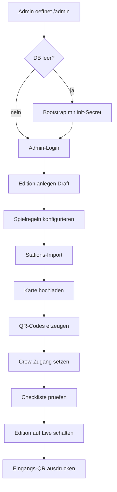
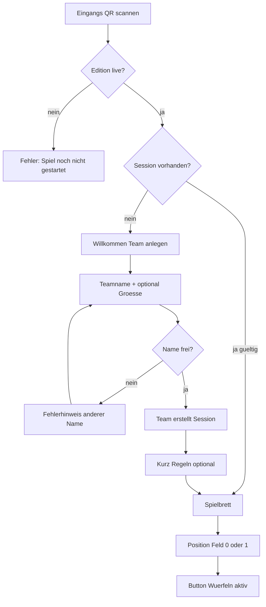

# Scope — User Flows: Admin & Onboarding

Part of the product spec. Hub: [`SCOPE.md`](../SCOPE.md).

## User Flows

### UF-0 — Erstes Spiel anlegen (Admin)

**Rolle:** Organisator:in (Laptop, vor dem Festival)  
**Ziel:** Eine spielbare **Edition** existiert — mit Content, QR-Codes, Crew-Zugang; Teams können sich erst registrieren, wenn die Edition **live** ist.

### Voraussetzungen

- App deployed (z.B. `spiel.zugvoegel-festival.de`)
- `ADMIN_INIT_SECRET` in Env gesetzt (einmaliger Bootstrap, analog Schwarmplaner `/api/auth/init`)
- Stations-Content als YAML: **N Stationen = N Felder** (z.B. 30–50 pro Edition)

### Phasen des Flows



### Schritt-für-Schritt

| # | Schritt | UI / Aktion | System |
|---|---------|-------------|--------|
| 1 | **Admin-Bereich öffnen** | Browser → `/admin` | Zeigt Login oder „Erstinstallation“ |
| 2 | **Erstinstallation (nur einmal)** | Secret eingeben → „Installation starten“ | Legt ersten Admin-Account an (oder validiert Env-Admin); erzeugt leere DB-Struktur |
| 3 | **Admin einloggen** | E-Mail + Passwort (oder Admin-Secret-Session) | JWT/Session für Admin-Routen |
| 4 | **Neue Edition** | „Spiel anlegen“ → Name z.B. „Zugvögel 2026“, Zeitraum Festival-Wochenende | `editions.status = draft` |
| 5 | **Spielregeln** | Würfel (1–6), Hinweis-Timer (Min.), optional: Edition-Ende automatisch | Werte in `editions.config` |
| 6 | **Stationen importieren** | YAML/JSON hochladen oder `pnpm db:seed` | Feldnummern **1…N** lückenlos; `editions.field_count = N` |
| 7 | **Import prüfen** | Tabelle: Feldnr., Kurzname, Typ (Quiz/Performance) | Performance nur wo Crew eingeplant |
| 8 | **Festival-Karte** | PNG/WebP hochladen (Geländeplan) | Gespeichert pro Edition; Stationen referenzieren `map_x` / `map_y` in % |
| 9 | **QR-Codes erzeugen** | Button „QR-Codes generieren“ | Pro Station URL `https://…/s/{slug}?t={qr_token}`; Download als PDF/ZIP zum Drucken |
| 10 | **Crew-Zugang** | Crew-Passwort setzen (oder Liste einfacher Crew-Logins) | Hash in DB; gilt nur für diese Edition |
| 11 | **Eingangs-QR (Teams)** | Vorschau + Download | URL `https://…/{slug}/join` — ein QR am Festival-Eingang |
| 12 | **Checkliste** | UI zeigt: ≥1 Station aktiv, Karte da, Crew-Passwort gesetzt, Edition-Zeitraum plausibel | Blockiert „Live“ bei harten Fehlern |
| 13 | **Live schalten** | Toggle „Spiel ist live“ | `status = live` → Team-Registrierung + Würfeln freigeschaltet; Leaderboard sichtbar |
| 14 | **Vor Ort (optional Draft-Test)** | „Test-Team“ anlegen, ein Probedurchlauf | Test-Teams im Leaderboard markieren oder nach Test löschen |

### Edition-Status (Admin-sichtbar)

| Status | Teams | Würfeln | Leaderboard |
|--------|-------|---------|-------------|
| `draft` | nein | nein | versteckt / leer |
| `live` | ja | ja | öffentlich |
| `paused` | nein (neu) | nein | eingefroren, Stand bleibt |
| `ended` | nein | nein | Endergebnis fix |

### Was Admin im MVP **nicht** im UI macht

- Stationen einzeln per Formular anlegen/bearbeiten → V1; MVP = Import + ggf. manueller DB-Fix
- Spielbrett-Grafik designen → Design-Asset, nicht Admin-UI
- Crew einzeln einladen per E-Mail → MVP: gemeinsames Crew-Passwort

### API-Skizze (Admin-Flow)

- `GET /api/admin/init` — Bootstrap (Secret)
- `POST /api/admin/auth/login`
- `POST /api/admin/editions` — Edition anlegen
- `PATCH /api/admin/editions/:id` — Config + Status
- `POST /api/admin/editions/:id/stations/import` — YAML Upload
- `POST /api/admin/editions/:id/map` — Kartenbild
- `POST /api/admin/editions/:id/qr/export` — PDF/ZIP
- `GET /api/admin/editions/:id/checklist` — Preflight vor Live

### Beispiel YAML (Import, vereinfacht)

```yaml
tasks:
  - field: 1
    slug: sueden-tor
    hint_vague:
      de: "Dort wo der Vogelzug beginnt, hörst du Trommeln."
      en: "Where the migration begins, you hear drums."
    hint_medium:
      de: "Südlicher Eingang, große Bühne in der Nähe."
      en: "South entrance, main stage nearby."
    map: { x: 12, y: 88 }
    activity:
      type: quiz
      question:
        de: "Wie viele Felder hat der Vogelzug?"
        en: "How many fields does the migration have?"
      answers:
        de: ["99", "neunundneunzig"]
        en: ["99", "ninety-nine"]
  - field: 2
    slug: ...
    activity:
      type: performance
      text:
        de: "Stellt euch als Schwarm vor und ruft einen Vogelruf."
        en: "Form a flock and call like migrating birds."
```

### UF-1 — Team-Onboarding (Eingangs-QR → Spielbereit)

**Rolle:** Festivalbesucher:innen (1 Smartphone pro Team, 1–5 Personen)  
**Ziel:** Team ist registriert, Session gespeichert, Spielbrett sichtbar, **erster Würfel** möglich.  
**Voraussetzung:** Edition `live` (UF-0 abgeschlossen).

### Phasen des Flows



### Schritt-für-Schritt

| # | Schritt | UI / Aktion | System |
|---|---------|-------------|--------|
| 1 | **Eingangs-QR scannen** | Kamera / QR-App → öffnet PWA-URL `/{slug}/join` | Browser lädt PWA; Service Worker cached Shell |
| 2 | **Edition prüfen** | Wenn nicht `live`: freundliche Meldung + Festival-Info | `GET /api/editions/:id/public` → status |
| 3 | **Bestehende Session?** | Cookie/`localStorage` mit Team-Token vorhanden | `GET /api/me` → 200 = direkt Spielbrett; 401 = weiter zu Schritt 4 |
| 4 | **Willkommensseite** | Kurztext: „Zugvögel — Team anlegen“, Hinweis 1 Gerät pro Team | Kein Account, kein Passwort |
| 5 | **Teamname** | Freitext, 3–32 Zeichen, trim, keine Sonderzeichen-Explosion | Client-Validierung + Server uniqueness pro `edition_id` |
| 6 | **Team-PIN** | 4 Ziffern, zweimal eingeben zur Bestätigung | `teams.pin_hash` (bcrypt); **kein** Passwort/Account — nur Wiederherstellung am Gerät |
| 7 | **Teamgröße (optional)** | Auswahl 1–5 oder Zahl — nur Statistik, keine Spielwirkung | Gespeichert in `teams.size` |
| 8 | **Team erstellen** | Button „Los geht's“ / „Vogelzug starten“ | `POST /api/teams` → `team_id`, `team_qr_token`, `session_token`, `position_confirmed = 0` |
| 9 | **Session speichern** | HttpOnly-Cookie bevorzugt | Token gehasht in DB; bei Rejoin altes Token invalidieren |
| 10 | **Onboarding** | `/{slug}/onboarding`: Spielfigur wählen → Banden-Motto + Regeln bestätigen | `PATCH /api/teams/onboarding`; `teams.avatar_id`, `teams.motto`, `teams.onboarding_completed_at` |
| 11 | **Spielbrett** | Vogelzug 1…**N**, Team auf Feld 0; **„Unser Team-QR“**; Motto in Play + Leaderboard | `GET /api/me` inkl. `field_count`, `teamQrUrl` |
| 12 | **Erster Würfel** | Button „Würfeln“ | `POST /api/turns/roll` → UF-2 |

### Team-QR (Identität des Teams)

Jedes Team erhält einen **eigenen Team-QR** (bei Anlage generiert, unverändlich pro Edition).

| Aspekt | Details |
|--------|---------|
| **URL** | `https://…/t/{teamSlug}?t={team_qr_token}` |
| **Anzeige (Team-App)** | Auf `/play`: Button/Sheet „Unser Team-QR“ — Vollbild-QR + Teamname (für Crew zum Scannen) |
| **Scan durch Crew** | Identisch wie Teamsuche → springt zur Bewertungs-Detailseite (UF-3) |
| **Scan durch anderes Team** | **Nicht MVP** — URL liefert nur „Team XYZ“ ohne Spielaktion (V2: Team-vs-Team-Aufgaben) |
| **Sicherheit** | `team_qr_token` opaque; Rate-Limit; QR allein erlaubt **keine** Bewertung ohne Crew-Login |

### Bildschirme (MVP)

1. **`/join`** — Landing + Team-Formular (oder Redirect wenn Session); Link „Team wiederfinden“
2. **`/rejoin`** — Teamname + 4-stellige PIN → Session wiederherstellen
3. **`/onboarding`** — Spielfigur, Motto, Regeln (nach neuer Bande; Pflicht vor `/play`)
4. **`/play`** — Spielbrett + Aktionsbereich; Sheet **„Unser Team-QR“**
5. **`/rules`** — Statische Spielregeln (verlinkt von Join + Play)
6. **`/t/{teamSlug}`** — Deep-Link aus Team-QR; Crew eingeloggt → Weiterleitung Bewertung; sonst Login-Prompt; anderes Team (MVP): nur Anzeige Name, keine Aktion

### Fehler- & Randfälle

| Situation | Verhalten |
|-----------|-----------|
| Teamname bereits vergeben | „Dieser Name fliegt schon mit — bitte einen anderen wählen.“ |
| Edition `paused` / `ended` | Kein neues Team; bestehende Session: nur Lesen / „Spiel pausiert“ |
| Doppeltes Absenden Formular | Idempotent: gleicher Name + gleiches Gerät → bestehendes Team zurückgeben (optional) oder klarer Fehler |
| Browser-Tab zu / Gerät weg | `/rejoin` oder Link auf `/join`: Teamname + PIN → neue Session, Spielstand unverändert |
| PIN vergessen | Crew/Admin: PIN zurücksetzen → Team setzt auf `/rejoin` neue PIN (oder einmalige Temp-PIN anzeigen) |
| Falsche PIN (3×) | Kurze Sperre (z.B. 5 Min.) + Hinweis „Infostand/Crew“ |
| Fremdes Team „übernehmen“ | Rate-Limit auf `/rejoin`; PIN nur 10.000 Kombinationen — für Festival akzeptabel; kein Leaderboard-Zugriff ohne PIN |
| PWA „Zum Home-Bildschirm“ | Nach erstem Besuch Banner/Hinweis (iOS: manuell teilen) |
| Schlechtes Netz beim Anlegen | Formular disabled + Retry; Team erst nach Server-OK |

### Session-Modell (MVP)

- **Ein aktives Gerät pro Team** — Rejoin invalidiert vorheriges Session-Token
- Token opaque, serverseitig invalidierbar (Admin/Crew: Team sperren)
- **Kein** E-Mail/Passwort; **Team-PIN (4 Ziffern)** nur für Rejoin auf neuem Gerät
- PIN wird nie im Klartext angezeigt nach Anlage (nur bei Reset durch Crew kurz sichtbar optional)

### UF-1b — Team wiederfinden (`/rejoin`)

**Auslöser:** Session verloren (Browser-Daten gelöscht, anderes Handy, Akku leer).

```mermaid
flowchart TD
  A[join oder rejoin oeffnen] --> B{Session gueltig?}
  B -->|ja| Play[/play]
  B -->|nein| C[Teamname + PIN]
  C --> D{Match?}
  D -->|ja| E[Neue Session Cookie]
  E --> Play
  D -->|nein| F[Fehler + Retry Limit]
  F --> G[Link Infostand]
  G --> H[Crew setzt PIN zurueck]
  H --> C
```

| # | Schritt | UI | System |
|---|---------|-----|--------|
| 1 | Link „Team wiederfinden“ | auf `/join` und in Fehlermeldungen | — |
| 2 | Eingabe | Teamname + 4-stellige PIN | `POST /api/teams/rejoin` |
| 3 | Erfolg | Redirect `/play`, Stand wie vorher | Neues `session_token`, altes invalidiert |
| 4 | PIN vergessen | Hinweis: Crew am Infostand | — |
| 5 | **Crew/Admin PIN-Reset** | Crew- oder Admin-UI: Team suchen → „PIN zurücksetzen“ | `POST /api/crew/teams/:id/reset-pin` oder Admin-Äquivalent; optional Temp-PIN generieren |
| 6 | Nach Reset | Team auf `/rejoin` mit Temp-PIN oder Crew diktiert neue PIN beim Team | `PATCH` neuer PIN durch Team auf `/rejoin/set-pin` (nur mit frischer Reset-Session oder Temp-Token) |

**Sicherheit (MVP):** PIN-Hash mit bcrypt; max. 5 Fehlversuche / 15 Min. pro Teamname+IP; Crew-Reset im Audit-Log.

### API-Skizze (Team-Onboarding)

| Method | Path | Auth | Beschreibung |
|--------|------|------|--------------|
| GET | `/api/editions/:id/public` | — | Name, status, ends_at (für Join-Seite) |
| POST | `/api/teams` | — | Body: `{ editionId, name, pin, size? }` → Team + Set-Cookie |
| POST | `/api/teams/rejoin` | — | Body: `{ editionId, name, pin }` → neue Session |
| PATCH | `/api/teams/pin` | Team-Session oder Reset-Token | PIN ändern (nach Crew-Reset) |
| PATCH | `/api/teams/onboarding` | Team-Session | Avatar (`avatarId`) oder Abschluss (`motto`, `rulesAccepted: true`) |
| GET | `/api/me` | Team-Session | Team, Position, offener Zug, Edition-Config |
| POST | `/api/teams/logout` | Team-Session | Session löschen (optional) |
| POST | `/api/crew/teams/:id/reset-pin` | Crew | PIN-Hash löschen/Temp-PIN; Audit-Log |
| POST | `/api/admin/teams/:id/reset-pin` | Admin | wie Crew |

### Übergang zu UF-2

Nach erfolgreichem **ersten Würfel** (`POST /api/turns/roll`):

- `position_pending` gesetzt
- vage Stationsbeschreibung sichtbar
- Hinweis-Timer startet
- UI wechselt von Idle → „Zug läuft“ (kein zweiter Würfel bis Abschluss/Abbruch)

**Startposition (festgelegt):** `position_confirmed = 0` (vor Feld 1). Wurf addiert: `position_pending = min(field_count, position_confirmed + dice)`.
