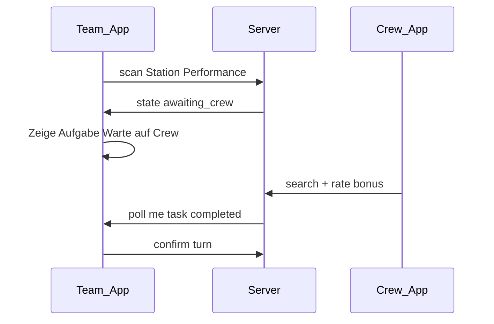

# Scope — User Flows: Crew & Leaderboard

Part of the product spec. Hub: [`SCOPE.md`](../SCOPE.md).

### UF-3 — Crew-Bewertung (Performance-Aufgaben)

**Rolle:** Crew-Mitglied (Smartphone/Tablet am Stand)  
**Ziel:** Performance-Aufgabe eines Teams bewerten → Team kann Zug bestätigen; optional Bonus +1 Feld.  
**Zusatz:** PIN-Reset für Teams (UF-1b) aus dem Crew-Bereich.

**Voraussetzung:** Edition `live`; Crew eingeloggt; an Performance-Stationen: Crew mit **Erkennungsmerkmal** (Badge/Bändchen) am Körper.

### Phasen des Flows

```mermaid
flowchart TD
  A[/crew oeffnen] --> B{Crew Session?}
  B -->|nein| C[Login Crew Passwort]
  B -->|ja| D[Crew Dashboard]
  C --> D
  D --> E{Aktion}
  E -->|Bewerten| F[Team suchen ODER Team QR scannen]
  E -->|PIN Reset| G[Team suchen oder QR scannen]
  F --> H{Offene Performance?}
  H -->|ja| I[Bewertung ok oder bonus]
  H -->|nein| J[Hinweis kein offener Auftrag]
  I --> K[Team App aktualisiert]
  K --> L[Team bestaetigt Zug]
  G --> M[Temp PIN / Reset Token]
```

### Schritt-für-Schritt — Login & Dashboard

| # | Schritt | UI | System |
|---|---------|-----|--------|
| 1 | **Crew-App öffnen** | `/crew` (Bookmark auf Crew-Geräten) | PWA, gleiche Domain wie Spieler-App |
| 2 | **Login** | Edition vorausgewählt (URL `/{slug}/crew/login` oder Crew-Session) + **Crew-Passwort** | `POST /api/crew/login` → Crew-Session-Cookie |
| 3 | **Dashboard** | „Team bewerten“ · „Team-QR scannen“ · „PIN zurücksetzen“ | Optional: Warteschlange offener Performance-Anfragen |

### Schritt-für-Schritt — Team identifizieren (Suche **oder** QR)

| # | Schritt | UI | System |
|---|---------|-----|--------|
| 4a | **Team suchen** | Suchfeld mit Autocomplete (ab 2 Zeichen) | `GET /api/crew/teams/search?q=…` |
| 4b | **Team-QR scannen** | Button „Team-QR scannen“ → In-App-Kamera (wie Stations-QR) | URL `/t/{teamSlug}?t=…` parsen |
| 4c | **QR auflösen** | — | `GET /api/crew/teams/resolve?slug=&t=` → `teamId` (nur mit Crew-Session) |
| 4d | **Deep-Link ohne Login** | System-Kamera scannt Team-QR | Redirect `/crew/login?next=/crew/teams/{id}` |

### Schritt-für-Schritt — Team bewerten (Kernflow)

| # | Schritt | UI | System |
|---|---------|-----|--------|
| 5 | **Team-Detail** | Name, Position, **offene Aufgabe** (nach Suche oder QR) | `GET /api/crew/teams/:id` inkl. `currentTurn` |
| 6 | **Kein offener Performance-Zug** | „{Team} wartet gerade nicht auf eine Bewertung.“ | `turn.state !== awaiting_crew` oder Task-Typ ≠ performance |
| 7 | **Aufgabe anzeigen** | Stationsname, Feldnummer, Aufgabentext | aus `task.payload` + Station |
| 8 | **Bewertung** | **„Geschafft“** (`ok`) · **„Besonders gut“** (`bonus`, +25 Punkte) | `POST /api/crew/rate { teamId, turnId, rating }` |
| 9 | **Bestätigung** | „Bewertung gespeichert“ | `crew_ratings` + `turn.task_completed_at`; `bonus` → +25 in `score_delta` |
| 10 | **Team-Seite** | Team zeigt ggf. weiter Team-QR; App pollt → „Aufgabe gelöst“ → **Zug bestätigen** | `GET /api/me` |

**Ablauf vor Ort (Performance):** Team scannt **Stations-QR** → zeigt Aufgabe + **„Unser Team-QR“** groß → Crew scannt **Team-QR** (schneller als Namen tippen) → bewertet.

**Wichtig:** Crew bewertet **nach** der Vorführung — Team hat Stations-QR bereits gescannt (`awaiting_crew`).

### Option: Warteschlange (MVP nice-to-have)

| # | Schritt | UI | System |
|---|---------|-----|--------|
| — | **Offene Anfragen** | Dashboard-Liste: Teamname, Station, seit X Min. wartend | `GET /api/crew/pending` — alle `turn.state = awaiting_crew`, sortiert nach `awaiting_since` |
| — | Tap auf Eintrag | springt zu Schritt 7–9 | — |

Identifikation immer über **Name oder Team-QR** (gleiche Zielseite).

### Schritt-für-Schritt — PIN zurücksetzen (UF-1b)

| # | Schritt | UI | System |
|---|---------|-----|--------|
| 11 | **PIN zurücksetzen** | Dashboard → Team suchen **oder** Team-QR scannen | — |
| 12 | **Bestätigen** | „PIN für {Team} zurücksetzen?“ | `POST /api/crew/teams/:id/reset-pin` |
| 13 | **Temp-PIN** | 4-stellige Ziffern groß anzeigen (einmalig) + Hinweis ans Team diktieren | Server setzt Temp-PIN oder `pin_reset_token`; Audit-Log |
| 14 | **Team** | Geht zu `/rejoin`, meldet sich an, setzt neue PIN | `PATCH /api/teams/pin` |

### Crew-Berechtigungen (MVP)

| Darf | Darf nicht |
|------|------------|
| Performance bewerten (`ok` / `bonus`) | Quiz-Aufgaben lösen |
| Team-PIN zurücksetzen | Spielstand / Position manuell ändern |
| Teams suchen + Team-QR scannen (read) | Edition-Config ändern (→ Admin) |
| Team-QR auflösen → Bewertung/PIN-Reset | Als anderes Team QR scannen mit Spielwirkung (V2) |

Admin kann dieselben PIN-Reset- und Notfall-Aktionen unter `/admin`.

### Bildschirme (MVP)

1. **`/crew/login`** — Passwort
2. **`/crew`** — Dashboard (Bewerten, Team-QR-Scanner, PIN-Reset, optional Warteschlange)
3. **`/crew/teams/[id]`** — Detail + Bewertungsbuttons
4. **`/crew/teams/[id]/reset-pin`** — Bestätigung + Temp-PIN-Anzeige

Mobile-first, große Buttons (oft Handschuhe / Sonne).

### API-Skizze (Crew)

| Method | Path | Auth | Beschreibung |
|--------|------|------|--------------|
| POST | `/api/crew/login` | — | `{ editionId, password }` |
| POST | `/api/crew/logout` | Crew | Session beenden |
| GET | `/api/crew/pending` | Crew | Offene Performance-Züge (optional) |
| GET | `/api/crew/teams/search` | Crew | `?q=` Autocomplete |
| GET | `/api/crew/teams/resolve` | Crew | `?slug=&t=` — Team-QR → `teamId` |
| GET | `/api/crew/teams/:id` | Crew | Team + aktueller Turn |
| POST | `/api/crew/rate` | Crew | `{ teamId, turnId, rating: 'ok' \| 'bonus' }` |
| POST | `/api/crew/teams/:id/reset-pin` | Crew | Temp-PIN + Audit |

### Randfälle & Regeln

| Situation | Verhalten |
|-----------|-----------|
| Doppel-Bewertung gleicher Zug | 409 — bereits bewertet |
| Team hat Performance beendet, Crew tippt falsch | Nur Suche nach **exaktem** Teamnamen; Crew sieht Aufgabentext zur Verifikation |
| — | Crew-Bonus nur Punkte, kein Extra-Feld |
| Edition `paused` | Keine neuen Bewertungen; laufende `awaiting_crew` einfrieren |
| Crew-Logout | Session weg; keine sensiblen Daten im UI cachen |
| Mehrere Crew am selben Stand | Gleiches Passwort OK (MVP); Audit-Log mit `crew_session_id` |

### Verknüpfung UF-2 ↔ UF-3



### UF-4 — Öffentliches Live-Leaderboard

**Rolle:** Publikum, Teams (neugierig), Organisator (Großbildschirm)  
**Ziel:** Jederzeit transparent sehen, welches Team wo auf dem Vogelzug steht — ohne Login.  
**Route:** `/{slug}/leaderboard` (QR am Festival / Link aus Team-App)

### Phasen des Flows

```mermaid
flowchart TD
  A[QR oder Link] --> B[/leaderboard]
  B --> C{Edition live oder ended?}
  C -->|draft| D[Hinweis Spiel startet bald]
  C -->|live oder ended| E[Rangliste + Brett]
  E --> F[Polling alle 8s]
  F --> E
  E --> G{Gewinner?}
  G -->|ja| H[Sieger Banner]
```

### Schritt-für-Schritt

| # | Schritt | UI | System |
|---|---------|-----|--------|
| 1 | **Leaderboard öffnen** | QR am Infostand / Bühne / Link in Team-App „Rangliste“ | `GET /api/editions/:id/public` |
| 2 | **Edition nicht gestartet** | `draft` → „Der Vogelzug beginnt gleich“ + Festival-Logo | Keine Teamliste |
| 3 | **Daten laden** | Erste Anzeige | `GET /api/leaderboard?editionId=` |
| 4 | **Visualisierung** | **Vogelzug-Brett** (N Felder) + Rangliste | Position DESC |
| 5 | **Team-Eintrag** | Tab **Vogelzug:** Feld; Tab **Highscore:** alle Teams + Punkte, Badge unterwegs/fertig; nach `ended` nur Fertige | Test-Teams optional ausblenden |
| 6 | **Live-Update** | Dezente Aktualisierung ohne Vollblink | Client-Polling 8 s (MVP); `etag` / `updatedAt` für 304 |
| 7 | **Eigenes Team** | Nur wenn Team-Session: Zeile hervorgehoben „Ihr seid hier“ | `GET /api/me` optional parallel |
| 8 | **Ziel erreicht** | Banner „{Name} hat den Vogelzug geschafft!“ | `teams.reached_goal_at`; Highscore-Sieger = max. Punkte unter Qualifizierten |
| 9 | **Spiel beendet** | `ended` → Rangliste eingefroren, Sieger oben | Kein Polling-Inkrement nötig |

### Anzeige-Regeln

| Feld | Anzeige |
|------|---------|
| `position_confirmed = 0` | „Start“ / vor Feld 1 |
| `1–98` | Feldnummer |
| `N` (Ziel) | „Am Ziel“ + qualifiziert für Highscore |
| Offener Zug (`pending`) | **Nicht** auf Leaderboard vor Bestätigung (nur `position_confirmed` — verhindert Spoilern) |

### Zugriff & Performance (MVP)

- **Kein Login** — öffentlicher Endpoint, nur Read
- Rate-Limit pro IP (z.B. 60 req/min) — schützt vor Scraping
- Response klein halten: `{ teams: [{ id, name, position, isWinner, rank }] , updatedAt }`
- Großbild: CSS „projection mode“ optional (`?display=screen` — größere Schrift, Auto-Refresh)

### Verknüpfungen

| Von | Link |
|-----|------|
| Team-App `/play` | Icon „Rangliste“ → `/{slug}/leaderboard` |
| Admin Live-Schalten | Leaderboard-QR zum Ausdrucken (wie Eingangs-QR) |
| Gewinn-Overlay (UF-2 E3) | Button „Zur Rangliste“ |

### API-Skizze (Leaderboard)

| Method | Path | Auth | Beschreibung |
|--------|------|------|--------------|
| GET | `/api/leaderboard` | — | `?editionId=` — sortierte Teams, `updatedAt`, `winnerTeamId` |
| GET | `/api/editions/:id/public` | — | status, name, für leere Zustände |

### Randfälle

| Situation | Verhalten |
|-----------|-----------|
| Edition `paused` | Letzter Stand + Hinweis „Spiel pausiert“ |
| Gleichstand gleiche Position | Früheres `reached_at` (wer zuerst dort war) rankt höher |
| Team-Name sensibel | Keine Moderation MVP — Admin kann Team sperren/umbenennen (Admin-Notfall) |
| Sehr viele Teams (80+) | Liste scrollbar; Brett zeigt Top-N + eigene Position |

### Nicht MVP (V1)

- WebSocket/SSE Push
- Animations-Rennen auf dem Brett
- Filter nach Kategorien / Wochenenden

