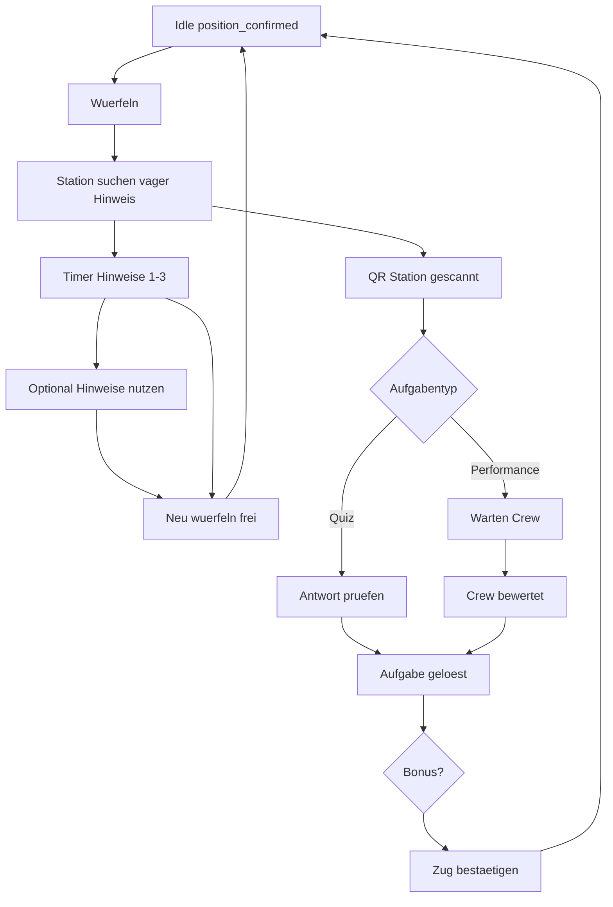

# Scope — User Flow: Spielzug (UF-2)

Part of the product spec. Hub: [`SCOPE.md`](../SCOPE.md).

### UF-2 — Kompletter Spielzug (Würfeln → Station → Aufgabe → Bestätigung)

**Rolle:** Team (Spieler-App `/play`)  
**Voraussetzung:** Team-Session aktiv, Edition `live`, kein offener Zug (`turn.state = idle`).

### Gesamtübersicht

### Phase A — Würfeln (Idle → Rolled)

| # | Schritt | UI | System |
|---|---------|-----|--------|
| A1 | **Würfeln** | Button nur wenn `!openTurn` | `POST /api/turns/roll` |
| A2 | **Ergebnis** | Würfelanimation + Zahl | `position_pending = min(field_count, position_confirmed + dice)` |
| A3 | **Ziel anzeigen** | „Ihr sucht Feld {n} von {N}“ + vager Hinweis | Station für `position_pending` |
| A5 | **Hinweis-Timer** | Stufen 1–3 nacheinander; Preise sichtbar | Edition-Config z.B. 3/6/9 min |

### Phase B — Station finden (Hinweise & 0-Runde)

| # | Schritt | UI | System |
|---|---------|-----|--------|
| B1 | **Suchen** | Team auf dem Gelände | — |
| B2 | **Hinweis Stufe 1–3** | Nach Timer freigeschaltet; Anzeige mit **Punkte-Kosten** (günstig) | `POST …/hint { level }` → Punkteabzug im `turn` vorgemerkt |
| B3 | **Alle Hinweise jetzt** | Bestätigungsdialog **„−50 Punkte“** → dann alle 3 sichtbar; Punkte sofort abziehen + Animation | `POST …/hint { mode: 'reveal_all' }` |
| B4 | **Neu würfeln** | Nach `reveal_all` **sofort**; sonst wenn Timer 3/3 | — |
| B5 | **0-Runde** | Dialog: „Keine Station gefunden — ihr bleibt stehen, keine Punkte für diesen Zug“ | `POST …/abandon` → `score_delta=0`, `position_confirmed` unchanged |

**Timer (Entwurf):** 3 / 6 / 9 min — Warten = günstigere Einzel-Hinweise als „alle jetzt“.

### Phase C — QR-Scan (Rolled → Scanned)

**Primär: In-App-Scanner-Button** (MVP). Fallback: System-Kamera / QR-App öffnet Deep-Link.

| # | Schritt | UI | System |
|---|---------|-----|--------|
| C1 | **„Station scannen“** | Prominenter Button während `turn.state = rolled` (Suchphase) | Öffnet Vollbild-Scanner (`/play/scan` oder Modal) |
| C2 | **Kamera-Freigabe** | Browser fragt `camera` — Hinweis wenn verweigert | `getUserMedia`; HTTPS Pflicht |
| C3 | **Live-Scan** | Suchrahmen, Vibration/Sound bei Erkennung | Client liest QR (z.B. `@zxing/browser` oder `BarcodeDetector` wo verfügbar) |
| C4 | **URL parsen** | — | Erwartet `/s/{slug}?t={token}` — andere URLs → „Kein Stations-QR“ |
| C5 | **Validierung** | Ladeindikator „Station wird geprüft…“ | `POST /api/turns/:id/scan { stationSlug, token }` |
| C6 | **Falsche Station** | Fehlermeldung + Scanner wieder offen | `station.field_number !== turn.position_pending` |
| C7 | **Richtige Station** | Scanner zu → Aufgaben-Screen | `turn.state = scanned`, Task laden |

**Fallback Deep-Link:** Wenn jemand den Stations-QR mit der **System-Kamera** scannt (ohne In-App-Button), öffnet sich `/s/{slug}?t=…` in der PWA → gleiche Validierung wie C5 (Session + offener Zug vorausgesetzt).

**Technik (MVP):**

- Composable `useQrScanner` in `web/app/composables/`
- Komponente `StationQrScanner.vue` (Kamera starten/stoppen, Debounce)
- iOS Safari: `BarcodeDetector` eingeschränkt → ZXing-Fallback einplanen
- Scanner nur aktiv bei offenem Zug in `rolled` (sonst Hinweis „Erst würfeln“)

### Phase D — Aufgabe lösen

**D-Quiz**

| # | Schritt | UI | System |
|---|---------|-----|--------|
| D1 | Frage + Eingabe | — | aus `task.payload` |
| D2 | Antwort senden | Feedback richtig/falsch | `POST /api/turns/:id/answer` — bei Erfolg `task_completed_at` |
| D3 | Falsch | Erneut versuchen (unbegrenzt MVP) | — |

**D-Performance**

| # | Schritt | UI | System |
|---|---------|-----|--------|
| D1 | Aufgabentext + **„Unser Team-QR“** (groß) + Hinweis „Crew scannt euren Team-QR“ | Status: wartend | `turn.state = awaiting_crew` |
| D1b | **„Weiter spielen und auf Crew warten“** | Position vorziehen, weiter würfeln; Banner „Feld {n} wartet auf Crew“ | `POST …/continue-playing` → `awaiting_crew_bg` |
| D2 | Crew bewertet (UF-3) | „Warte auf Bewertung…“ (oder Banner im Hintergrund); ab Timeout (O7): **Auto-OK** oder Button **„Neu würfeln“** (0-Runde, nur vor D1b) | Polling + `performance_timeout_at` |
| D3 | Bewertung `ok` | Aufgabe gelöst | — |
| D4 | Bewertung `bonus` | +25 Punkte (Entwurf) | in `score_delta`, kein Extra-Feld |

### Phase E — Zug bestätigen (Completed → Idle)

| # | Schritt | UI | System |
|---|---------|-----|--------|
| E1 | **Zug bestätigen** | Button nach gelöster Aufgabe | `POST /api/turns/:id/confirm` |
| E2 | **Position + Punkte** | Brett + Punkteanzeige aktualisieren | `position_confirmed = position_pending`; `score_total += score_delta` |
| E3 | **Ziel-Feld N** | Overlay „Vogelzug geschafft!“ — qualifiziert für Highscore | `reached_goal_at` |
| E4 | **Nächster Zug** | Würfeln wieder frei | zurück Idle |

### UI-Zustände auf `/play` (ein Screen, Bereiche wechseln)

| Zustand `turn.state` | Sichtbar |
|----------------------|----------|
| — (kein Turn) | Spielbrett + „Würfeln“ |
| `rolled` | Zielfeld, vager Hinweis, Timer, Hinweise (einzeln günstig / „alle jetzt“ teuer), Scan, „Neu würfeln“ (0-Runde) |
| `scanned` / `awaiting_crew` | Aufgabe |
| `completed` | „Zug bestätigen“ |
| `rolled` + scan jederzeit möglich | QR kann Station abschließen auch vor Ablauf aller Timer |

**Wichtig:** QR-Scan und erfolgreiche Aufgabe **beendet** die Suchphase — Team muss nicht auf alle Hinweis-Timer warten, wenn es die Station findet.

### API-Skizze (Spielzug)

| Method | Path | Beschreibung |
|--------|------|--------------|
| POST | `/api/turns/roll` | Neuer Zug |
| POST | `/api/turns/:id/hint` | Hinweis Stufe 1–3 anzeigen + Strafe merken |
| POST | `/api/turns/:id/abandon` | **0-Runde** — kein Fortschritt, keine Punkte |
| POST | `/api/turns/:id/scan` | Station validieren |
| POST | `/api/turns/:id/answer` | Quiz-Antwort |
| POST | `/api/turns/:id/confirm` | Zug abschließen |
| GET | `/api/turns/current` | Offener Zug inkl. Timer, freigeschaltete Hinweise |

### Randfälle

| Situation | Verhalten |
|-----------|-----------|
| Doppel-Würfeln | 409 — offener Zug existiert |
| Scan während `awaiting_crew` | Ignorieren oder Fehler |
| `position_pending > field_count` | Cap bei `field_count` |
| Edition `paused` mid-turn | Turn einfrieren, keine neuen Aktionen |
| Rejoin mid-turn | `GET /api/me` stellt exakt aktuellen `turn`-State wieder her |

