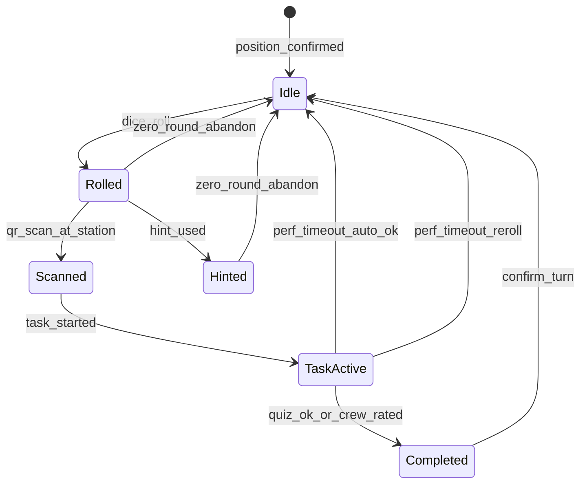

# Scope — Spielregeln & Zustandsmaschine

Part of the product spec. Hub: [`SCOPE.md`](../SCOPE.md). Implementation: [`AGENTS_ARCHITECTURE.md`](../AGENTS_ARCHITECTURE.md).

## Spielregeln → technische Regeln (verbindlich für MVP)

### Würfeln & Bewegung (Brett = zentral)

| Regel | Technische Umsetzung |
|-------|----------------------|
| Team würfelt in der App | Serverseitiger Zufall (1–6 oder konfigurierbar), **ein Wurf pro offenem Zug** |
| Vorwärts X Felder | Würfel-Schritte verbrauchen nur **noch nicht bestätigte** Felder; bereits bestätigte Felder werden **übersprungen** (O4: kein zweites Mal dieselbe Station) |
| Berechnung | Von `position_confirmed` aus `dice` Schritte vorwärts, Felder in `completed_fields` überspringen → `position_pending` (max `field_count`) |
| Vage Stationsbeschreibung | Nach Wurf: `hint_vague` für Station auf Feld `position_pending` |
| Zug bestätigt nur nach gelöster Aufgabe | `position_confirmed = position_pending` nach Task + Confirm; **Punkte** für diesen Zug in `score_delta` |
| Ziel | Letztes Feld = `field_count` (nicht literarisch 99) |

### Hinweise — Punkte-Ökonomie (festgelegt)

**Keine Feld-Strafen** durch Hinweise — nur **Punkteabzug** am Zug.

| Modus | Verhalten | Punkte (Entwurf) |
|-------|-----------|------------------|
| **Warten** | Stufe 1/2/3 werden nacheinander per Timer freigeschaltet; Nutzung **günstiger** | z.B. −10 / −12 / −15 (nur genutzte Stufen summieren) |
| **Alle sofort aufdecken** | Button „Alle Hinweise jetzt“ — sofort alle 3 sichtbar (Text + Karte) | z.B. **−50** Pauschal (teurer als geduldig alle einzeln) |
| Hinweise optional | Team muss keine nutzen | 0 Hinweis-Kosten |

Timer (Edition-Config): z.B. Stufe 1 nach 3 min, Stufe 2 nach 6 min, Stufe 3 nach 9 min — **Warten lohnt sich** punktemäßig.

### Neu würfeln = **0-Runde** (festgelegt)

| Regel | Technische Umsetzung |
|-------|----------------------|
| Auslöser | Station nicht gefunden; nach **„alle Hinweise jetzt“** sofort möglich (O5) **oder** alle 3 Timer-Stufen frei |
| UI O5 | Vor `reveal_all`: Bestätigung „−50 Punkte“; danach sofort **Neu würfeln** (0-Runde) anbieten |
| Effekt | **0-Runde:** kein Fortschritt, **`score_delta = 0`**, `position_confirmed` unverändert |
| Danach | Neuer Wurf von bestätigter Position erlaubt |
| Kein „Skip“ nach vorne | Man kann nicht ohne Aufgabe vorrücken |

### Aufgaben & Bewertung

| Typ | MVP | Anmerkung |
|-----|-----|-----------|
| **Quiz** | **Default** | Automatische Auswertung; jede Station mindestens Quiz |
| **Performance** | **Optional** | Nur an Stationen mit Crew vor Ort; Crew trägt **Erkennungsmerkmal** (Badge/Bändchen); Team-QR + Crew-Scan |
| **Weitere Typen** | V2+ | Bewusst später (Team-vs-Team etc.) |
| **Crew-Bonus „besonders gut“** | +25 Punkte, **kein Limit** (O8) | Performance optional; Engpass bewusst |
| **Performance-Timeout (O7)** | Nach z.B. 10 min `awaiting_crew`: **Auto-OK** (Basispunkte) **oder** Team wählt **Neu würfeln** (0-Runde) |

### Spielende & Wettbewerb — Punktesystem (festgelegt)

| Anzeige | Inhalt |
|---------|--------|
| **Vogelzug / Brett** | Zentral in Team-App: Position 0…**N** auf dem Vogelzug (Würfeln + vorwärts) |
| **Globale Liste** | Wo jedes Team steht (`position_confirmed`) — immer sichtbar |
| **Highscore (live)** | **Alle Teams** mit `score_total`; visuell getrennt: **unterwegs** vs. **Ziel erreicht** (z.B. Badge/Grau vs. Gold) |
| **Highscore (Edition ended)** | Nur noch Teams mit **Ziel erreicht**; Sortierung nach Punkten — offizieller Sieger |

**Sieger (Edition `ended`):**
- **Primär:** Teams mit Ziel erreicht → höchster `score_total`; bei Gleichstand **kürzeste Spielzeit** Start→Ziel (`reached_goal_at − created_at`) (O9)
- **Fallback (O10):** Kein Team erreicht N → Sieger = höchstes `position_confirmed`, bei Gleichstand höhere Punkte

Während `live`: Highscore zeigt alle Teams (unterwegs vs. fertig).

### Punkte pro abgeschlossenem Zug (Entwurf)

| Faktor | Punkte |
|--------|--------|
| Station geschafft | +100 Basis |
| Hinweise (warten, einzeln) | −10 / −12 / −15 je genutzter Stufe |
| Alle Hinweise sofort | −50 Pauschal |
| Quiz-Fehlversuche | −5 pro Fehlversuch |
| Zeit (Scan → Confirm) | Bonus bis +50 (schneller = mehr) |
| Crew-Bonus | +25 |
| **0-Runde (Neu würfeln)** | **0** (kein Eintrag oder explizit 0) |
| Gelaufene Felder / Würfel | neutral |

`teams.score_total` = Summe erfolgreicher Züge; `turns.score_delta` + `hint_mode` (`wait` \| `reveal_all`) speichern.

### Punkteformel v1 (zur Abnahme) + Rechenbeispiele

**Zeit (festgelegt — getrennt):**
- **Hinweis-Timer:** ab `rolled_at` — steuert Freischaltung Hinweis 1/2/3 (3/6/9 min)
- **Zeitbonus-Timer:** ab `scanned_at` (Stations-QR) bis `confirmed_at`  
  `zeit_bonus = max(0, 50 − floor(sekunden / 60) × 5)` — Suche zählt nicht gegen Zeitbonus

**Hinweis-Regeln:**
- Modus `reveal_all`: immer **−50** (auch wenn danach Station gefunden)
- Modus `wait`: nur **genutzte** Stufen summieren (−10 / −12 / −15)
- `reveal_all` und einzelne Stufen **schließen sich aus** pro Zug

| # | Szenario | Rechenung | **Punkte Zug** |
|---|----------|-----------|----------------|
| S1 | Perfekt: kein Hinweis, 2 min, 0 Fehlversuche | 100 + 45 − 0 | **145** |
| S2 | Geduldig: wartet alle Timer, nutzt Hinweis 1+2+3, 8 min, 1× falsch | 100 + 15 − 10 − 12 − 15 − 5 | **73** |
| S3 | Ungeduldig: „alle Hinweise jetzt“, 6 min, 2× falsch | 100 + 25 − 50 − 10 | **65** |
| S4 | Erst **0-Runde**, nächster Zug wie S1 | 0 + 145 | **145** (nur 2. Zug zählt) |
| S5 | Performance + Crew-Bonus, 4 min, kein Hinweis | 100 + 40 + 25 | **165** |
| S6 | **Vergleich Highscore:** Team Rot 8 Züge à ~120 = 960; Team Blau 6 Züge à ~145 = 870 | — | Rot gewinnt trotz langsamerem Vogelzug |

**Festival-Sieger (Beispiel N=42):** Team A und B erreichen Feld 42; A `score_total` 1840, B 1720 → **A gewinnt Highscore**. Team C Feld 38 → in Vogelzug-Liste, **nicht** im Highscore.

### Offene Punkte & Widersprüche (Stand Plan)

| ID | Thema | Status | Klärungsfrage |
|----|--------|--------|----------------|
| O1 | **Highscore-Anzeige** | **entschieden** | Live: alle Teams (Punkte + unterwegs/fertig); nach Edition-Ende: nur Fertige im offiziellen Ranking |
| O2 | **Zeitbonus vs. Hinweise** | **entschieden** | Getrennte Timer: Hinweise ab Wurf, Zeitbonus ab Scan |
| O3 | **Würfel > Ziel** | implizit | Cap bei N; Aufgabe auf Feld N muss gelöst werden |
| O4 | **Gleiches Feld** | **entschieden: nein** | Bestätigte Felder bei Wurf überspringen; keine Station zweimal |
| O5 | **Nach reveal_all** | **entschieden** | Sofort 0-Runde möglich; **vorher** Hinweis „−50 Punkte“ |
| O6 | **Hinweis + Erfolg** | geklärt | Hinweise kosten Punkte auch bei Erfolg |
| O7 | **Performance-Timeout** | **entschieden** | Auto-OK **oder** Neu würfeln (0-Runde) |
| O8 | **Crew-Bonus-Limit** | **entschieden: nein** | — |
| O9 | **Gleichstand Punkte** | **entschieden** | Kürzeste Zeit Start → Ziel |
| O10 | **Kein Team am Ziel** | **entschieden: ja** | Fallback: höchstes Feld, dann Punkte |
| O11 | **Plan-Widersprüche** | **angepasst** | UF-3, F8, Abbruch-Text, State-Diagramm |
| O12 | — | erledigt | — |

### UX — Punkte visuell (Pflicht MVP)

Jede Aktion mit Punktewirkung muss **sofort** sichtbar sein:

| Moment | UI |
|--------|-----|
| **Vor** kostenpflichtiger Aktion | Button/Dialog zeigt Preis: „−50 Punkte“, „−10 Punkte“ |
| **Nach** Abzug | Kurzanimation am Punktestand: rot, `−50`, Gesamtstand aktualisiert |
| **Nach** Zug-Bestätigung | Zusammenfassung: `+100 Basis`, `+30 Zeit`, `−15 Hinweis` → **+115 dieser Zug** |
| **Highscore / Header** | `score_total` blinkt rot (minus) oder grün (plus); optional Verlauf letzter Züge |
| **0-Runde** | „0 Punkte für diesen Versuch“ — kein roter Abzug am Gesamtstand (nur Hinweis-Kosten vorher schon abgezogen) |

Technik: `useScoreFeedback` Composable; `ScoreDeltaToast.vue`; Punkte-Breakdown in Confirm-Sheet.

### Spielmechanik — Unklarheiten, Spaß-Risiken, Klärungsbedarf

### Noch nicht final geklärt (Priorität hoch)

| # | Thema | Problem | Empfehlung zur Klärung |
|---|--------|---------|------------------------|
| K1 | **Hinweis-Strafe bei Erfolg** | → **gelöst Richtung Punkte:** Hinweise reduzieren `score_delta`, nicht zwingend Felder | Formel in Punkte-Entwurf finalisieren |
| K2 | **Warten vs. alle Hinweise** | „Alle aufdecken“ teuer — OK; UI muss Preis **vorher** zeigen | Copy: „Geduld spart Punkte“ |
| K3 | ~~Inaktives Feld~~ | **entfällt** — `field_count` = Anzahl Stationen | — |
| K4 | **Performance + Crew-Engpass** | Warteschlange, Crew nicht da, Team hängt in `awaiting_crew` | Timeout (z.B. 10 min) → Auto-`ok`; Crew-Warteschlange MVP; mehrere Crew-Logins; Notfall „Crew bestätigen“ am Infostand |

### Mechanik verständlich, aber Spaß gefährdet

| Risiko | Warum | Milderung |
|--------|--------|-----------|
| **Würfel-RNG + N Felder** | N = 30–50: noch ~15–25 erfolgreiche Züge bis Ziel | Kommunizieren: Highscore nur mit Ziel; unterwegs sichtbar auf Brett |
| **Ein Gerät pro Team** | Soziale Dynamik bricht, einer trägt Last | In Regeln: „Ein Handy, alle sehen mit“; Team-QR für Crew hilft |
| **Zug bestätigen (extra Tap)** | Fühlt sich redundant nach Quiz an | UI: „Aufgabe geschafft — Position sichern?“ mit klarer Belohnungsanimation |
| **Falsche Station gescannt** | Peinlich, besonders wenn Feld weit entfernt | Freundliche Copy; „Ihr sucht Feld 12, das ist Feld 7“ |
| **Bonus subjektiv (Crew)** | Ungerechtigkeit | Crew-Briefing; zwei Buttons; Audit (kein Limit, O8) |
| **Quiz + Internet** | Googeln oder Tippfehler-Frust | Alternative Antworten; Multiple Choice; Aufgaben ohne eindeutige Google-Treffer |
| **Leaderboard nur confirmed** | Weniger „Live-Spannung“ während Suche | OK für Fairness; optional „Team X ist unterwegs“ ohne Feld (V1) |
| **Hinweis-Stufen verwechselt** | vage vs. Stufe 1 vs. 2 unklar für Spieler | UI: „Tipp 1 von 3“, klare Labels; Kurzregeln am Eingang |
| **Lange Performance** | Blockiert Handy, Restgruppe wartet | Aufgaben kurz halten (Spieldesign); Team-QR, Crew-Scan schnell |

### Was gut für Spaß ist (bewusst beibehalten)

- Suche + Entdeckung (vager Hinweis vor Ort) — Kern des Geländespiels
- Station gefunden ohne Timer abwarten — sofort QR möglich
- Team-PIN + Team-QR — wenig Reibung bei Crew-Kontakt
- Abbruch ohne Positionsverlust (`confirmed` bleibt) — verhindert Skip, fair bei Verlaufen
- Öffentliches Leaderboard — sozialer Wettbewerb

### Playtest-Fragen (vor Festival)

1. Durchschnittliche Zugdauer (Suche + Aufgabe + Crew)?
2. Wie oft „Station nicht gefunden“ → Abbruch?
3. Kommen Teams ohne Hinweis-Nutzung zurecht?
4. Fühlt sich 15/10/5 min Timer fair an oder zu lang?
5. Schaffen 50 % der Teams mindestens Feld 30 im Festival-Zeitfenster?

---

## Zustandsmaschine „Zug“ (MVP-Pflicht)

**Server ist Source of Truth** für Zustand (Client zeigt nur an); verhindert Manipulation bei schlechtem Empfang.

**Abbruch-Regel (festgelegt):** Neu würfeln = **0-Runde** (kein Fortschritt, keine Punkte). Auslöser: alle Hinweis-Optionen verfügbar (Timer 3/3 **oder** „alle aufdecken“). `position_confirmed` bleibt.

---
